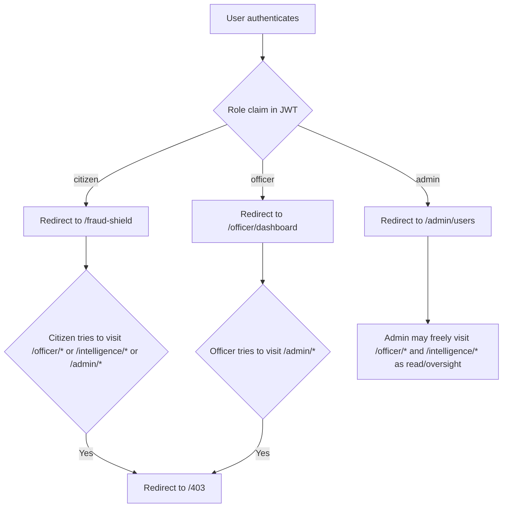
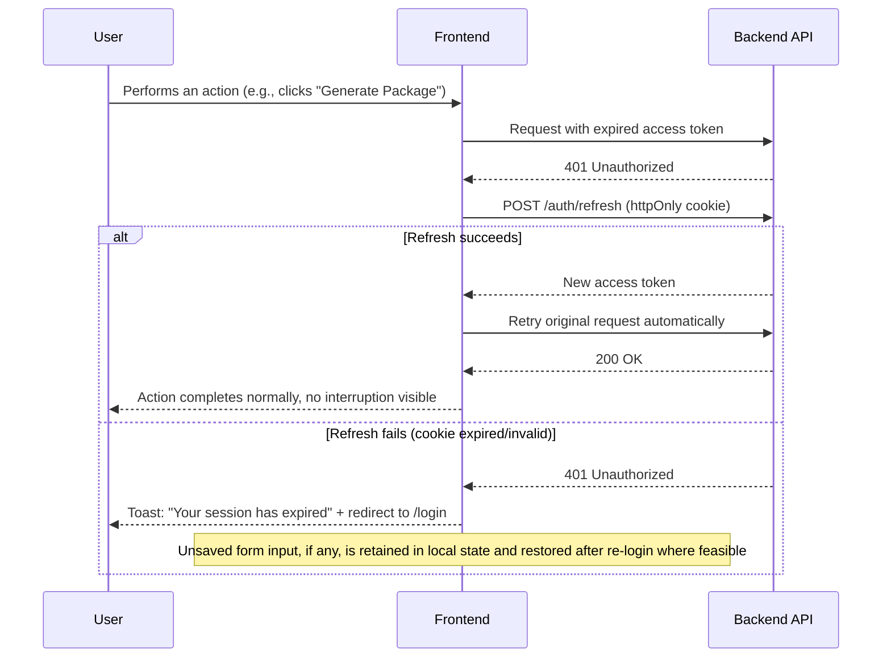
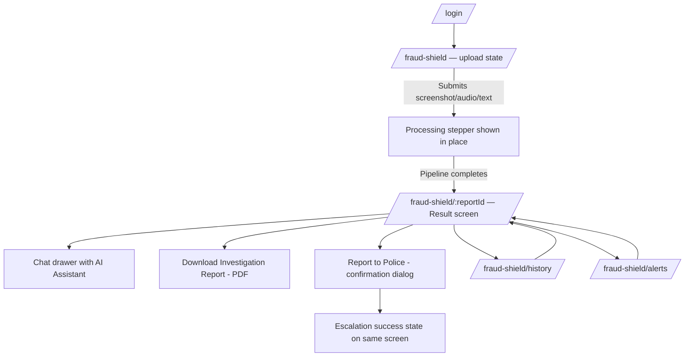
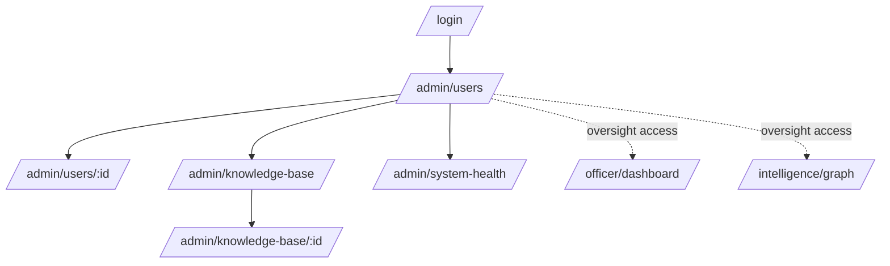
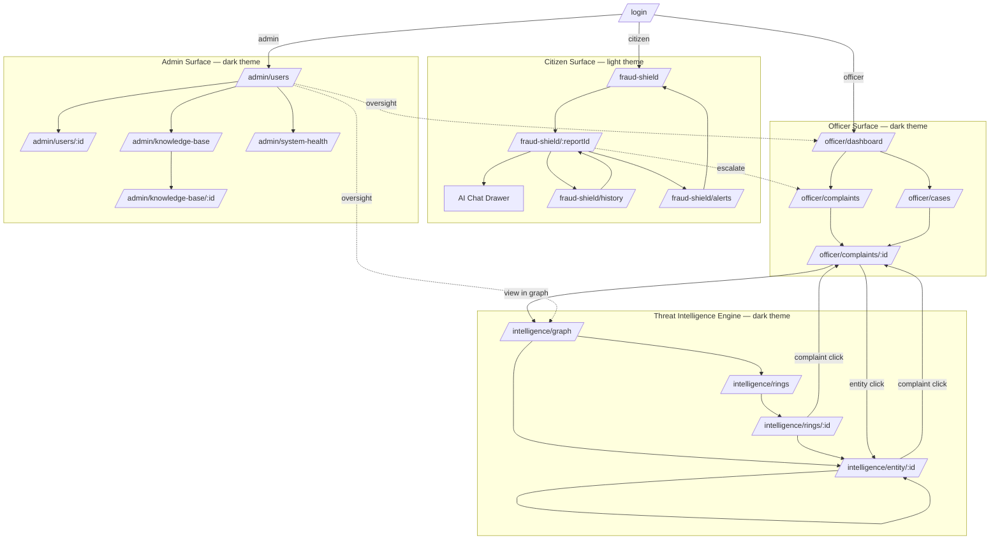

# Truvia — App Flow Document
### Complete Navigation, Screen, and Interaction Specification

**Companion to:** Truvia PRD v1.0, Truvia TRD v1.0
**Audience:** Frontend engineers, AI coding agents implementing UI, QA
**Purpose:** This document specifies every screen, every navigational transition, every component state, and every popup/dialog/toast in the product. No feature rationale is repeated here — see the PRD. No technical implementation (API internals, DB, deployment) is repeated here — see the TRD. This document answers exactly one question, exhaustively: **"What does the user see and do, screen by screen?"**

---

## Table of Contents

1. [Information Architecture — Complete Sitemap](#1-information-architecture--complete-sitemap)
2. [User Roles & Journey Overview](#2-user-roles--journey-overview)
3. [Global Patterns (used across all screens)](#3-global-patterns-used-across-all-screens)
4. [Authentication, Session, and Account Flows](#4-authentication-session-and-account-flows)
5. [Citizen Journey — Screen by Screen](#5-citizen-journey--screen-by-screen)
6. [Officer Journey — Screen by Screen](#6-officer-journey--screen-by-screen)
7. [Threat Intelligence Engine — Screen by Screen](#7-threat-intelligence-engine--screen-by-screen)
8. [Admin Journey — Screen by Screen](#8-admin-journey--screen-by-screen)
9. [Cross-Module Navigation](#9-cross-module-navigation)
10. [Global Popup / Dialog / Drawer / Toast Inventory](#10-global-popup--dialog--drawer--toast-inventory)
11. [Master Navigation Diagram](#11-master-navigation-diagram)

---

## 1. Information Architecture — Complete Sitemap

```
/
├── /login
├── /register                              (Citizen self-signup only)
├── /forgot-password
├── /reset-password/:token
│
├── /fraud-shield                          [Citizen home]
│   ├── /fraud-shield/:reportId             [Result / Explainability screen]
│   ├── /fraud-shield/history                [Scam History]
│   └── /fraud-shield/alerts                 [Recent Public Scam Alerts]
│
├── /officer/dashboard                      [Officer home — KPI overview]
├── /officer/complaints                     [Complaint table]
│   └── /officer/complaints/:id             [Investigation View]
├── /officer/cases                          [My assigned cases]
│
├── /intelligence/graph                     [Threat Intelligence Engine — graph home]
├── /intelligence/entity/:id                [Entity Explorer]
├── /intelligence/rings                     [Fraud Ring list]
│   └── /intelligence/rings/:id             [Ring detail — subgraph + correlated complaints]
│
├── /admin/users                            [User management]
│   └── /admin/users/:id                    [User detail/edit]
├── /admin/knowledge-base                   [Knowledge base source management]
│   └── /admin/knowledge-base/:id           [Document detail]
├── /admin/system-health                    [Pipeline/queue/agent health monitor]
│
├── /account/profile                        [Shared: profile settings, all roles]
├── /account/security                       [Shared: password change, sessions]
│
└── /403  /404  /500                        [Error/state pages]
```

**Route-group ↔ theme mapping:** `/fraud-shield/*` = light-mode, citizen-friendly theme. `/officer/*`, `/intelligence/*`, `/admin/*` = dark-mode, SOC-style theme. `/login`, `/register`, `/account/*` = neutral shared theme (adapts to the role of the logged-in user, or light-mode default when logged out).

**Upload is a page-state, not a route:** the report upload flow occurs entirely on `/fraud-shield` (dropzone → processing → auto-navigate to `/fraud-shield/:reportId` once a `report_id` exists). Chat with the AI Assistant is a **drawer** overlaying `/fraud-shield/:reportId`, not a separate route, so context (which report is being discussed) is never lost via a page transition.

---

## 2. User Roles & Journey Overview

### 2.1 Citizen
**Who:** Any member of the public who registers to report suspected fraud. **Primary surface:** Citizen Fraud Shield only. **Cannot access:** `/officer/*`, `/intelligence/*`, `/admin/*` (hard role guard — redirect to `/403`). **Core journey:** Land on Fraud Shield → submit evidence → receive scored, explained result → take a recommended action (report to police / dismiss as safe) → optionally revisit history or ask the AI Assistant questions.

### 2.2 Police (Officer / Analyst)
**Who:** Cybercrime cell officers and intelligence analysts. Both share one combined `officer` role in the MVP (full sub-role RBAC split into "Officer" vs. "Analyst" permissions is a documented v2 item, not built now). **Primary surface:** Officer Dashboard + Threat Intelligence Engine. **Cannot access:** `/admin/*`. **Core journey:** Land on Dashboard → scan KPIs/emerging trends → drill into Complaint Table → open Investigation View → cross-reference in Threat Intelligence Engine → generate Intelligence Package → export.

### 2.3 Admin
**Who:** Platform/system administrators — an operational role layered on top of the three PRD modules to handle user account management, knowledge base curation, and system health monitoring. **Primary surface:** Admin console. **Can also access:** everything Officers can access (Admin is a superset role), for oversight. **Core journey:** Land on User Management → review/approve officer accounts → maintain Knowledge Base sources → monitor pipeline/agent health on System Health screen.

### 2.4 Role Comparison Table

| Capability | Citizen | Officer | Admin |
|---|---|---|---|
| Submit reports | ✅ (own only) | ❌ | ❌ |
| View own reports/history | ✅ | — | — |
| View all complaints | ❌ | ✅ | ✅ |
| Assign cases | ❌ | ✅ | ✅ |
| Generate Intelligence Packages | ❌ | ✅ | ✅ |
| Access Threat Intelligence Engine | ❌ | ✅ | ✅ |
| Manage user accounts | ❌ | ❌ | ✅ |
| Manage knowledge base sources | ❌ | ❌ | ✅ |
| View system health | ❌ | ❌ | ✅ |

### 2.5 Role-Based Landing & Guard Logic



---

## 3. Global Patterns (used across all screens)

### 3.1 Loading State Convention
Every data-fetching screen follows a 3-tier loading pattern:
1. **Skeleton state** (first load, no cached data): gray placeholder blocks matching the final layout shape — never a bare spinner for primary content areas.
2. **Refetch/background state** (cached data exists, revalidating): existing content stays visible with a subtle top-of-content progress bar; no skeleton flash.
3. **Action-in-progress state** (button-triggered async action, e.g., "Generate Package"): the triggering button shows an inline spinner and becomes disabled; rest of the page remains interactive.

### 3.2 Empty State Convention
Every list/table screen defines an explicit empty state with: an icon, a one-line explanation, and — where actionable — a primary CTA (e.g., Citizen History empty state → "You haven't submitted any reports yet" + "Check a suspicious message" button linking to `/fraud-shield`).

### 3.3 Error State Convention
Every screen defines:
- **Inline field errors** (form validation) — shown directly below the offending input, red text, on blur or submit.
- **Request-failure banner** — a dismissible banner at the top of the content area for failed data fetches, with a "Retry" action, used instead of blanking the whole screen.
- **Full-page error fallback** — only for uncaught rendering exceptions (React error boundary), shown with a "Reload" button; distinct from request-failure banners.

### 3.4 Success State Convention
Transient confirmations use **toasts** (auto-dismiss, 4s, bottom-right on desktop / bottom-center on mobile). Durable confirmations (e.g., a report has been fully processed) update the screen's persistent content directly rather than relying on a toast alone.

### 3.5 Permission Denied Convention
Any route accessed by a role without permission redirects to `/403`, which displays: "You don't have access to this page" + a button back to the user's own role-appropriate home (`/fraud-shield` for citizen, `/officer/dashboard` for officer, `/admin/users` for admin).

---

## 4. Authentication, Session, and Account Flows

### 4.1 Login Screen — `/login`

| Field | Detail |
|---|---|
| Purpose | Authenticate an existing user and route them to their role-appropriate home |
| Components | Email input, password input, "Remember me" checkbox, "Forgot password?" link, "Log in" button, "New citizen? Register" link (citizen self-signup only — officer/admin accounts are provisioned, not self-registered) |
| Buttons | `Log in` (primary), `Forgot password?` (text link), `Register` (text link) |
| Navigation | On success → role-based redirect: `citizen → /fraud-shield`, `officer → /officer/dashboard`, `admin → /admin/users`. On "Register" click → `/register`. On "Forgot password?" click → `/forgot-password` |
| APIs Called | `POST /api/v1/auth/login` |
| Loading State | `Log in` button shows inline spinner, inputs disabled during request |
| Empty State | N/A (form screen) |
| Error State | Inline banner above form: "Incorrect email or password" (401); field-level validation for empty/malformed email prior to submit |
| Success State | Immediate redirect (no toast needed — the redirect itself is the confirmation) |
| Permission Required | Public (no auth) |

### 4.2 Register Screen — `/register` (Citizen only)

| Field | Detail |
|---|---|
| Purpose | Self-service account creation for citizens |
| Components | Name, email, password, confirm-password inputs, terms-acknowledgment checkbox, "Create account" button, "Already have an account? Log in" link |
| Navigation | On success → auto-login → `/fraud-shield` with a welcome toast. On "Log in" link → `/login` |
| APIs Called | `POST /api/v1/auth/register`, then `POST /api/v1/auth/login` (auto-login chain) |
| Loading State | Button spinner, form disabled |
| Error State | Inline field errors (password mismatch, weak password); banner for `409` ("An account with this email already exists" + link to `/login`) |
| Success State | Toast: "Welcome to Truvia" + redirect |
| Permission Required | Public |

### 4.3 Forgot Password — `/forgot-password`

| Field | Detail |
|---|---|
| Purpose | Initiate password reset via email |
| Components | Email input, "Send reset link" button, "Back to login" link |
| Navigation | On submit → stays on same screen, shows confirmation panel (does not reveal whether the email exists, for security) |
| APIs Called | `POST /api/v1/auth/forgot-password` |
| Loading State | Button spinner |
| Success State | Screen content swaps to: "If an account exists for this email, a reset link has been sent." (shown regardless of actual existence) |
| Error State | Only for malformed email (client-side) or `429` rate-limit ("Too many requests, try again later") |
| Permission Required | Public |

### 4.4 Reset Password — `/reset-password/:token`

| Field | Detail |
|---|---|
| Purpose | Set a new password using an emailed token |
| Components | New password input, confirm-password input, "Reset password" button |
| Navigation | On success → `/login` with success toast. If token invalid/expired on page load → replace form with an error panel + "Request a new link" button linking to `/forgot-password` |
| APIs Called | `POST /api/v1/auth/reset-password` |
| Loading State | Button spinner |
| Error State | Inline validation (password mismatch/strength); banner for expired/invalid token |
| Success State | Toast: "Password updated — please log in" |
| Permission Required | Public (token-authenticated) |

### 4.5 Session Expiry Flow



### 4.6 Logout Flow

1. User clicks **Log out** (in the account menu — present in the global header on every authenticated screen, see §3-shared header pattern).
2. A **confirmation dialog** appears: "Log out of Truvia?" with `Cancel` / `Log out` buttons (see §9.4).
3. On confirm → `POST /api/v1/auth/logout` → local access token cleared from memory, refresh cookie invalidated server-side → redirect to `/login` with toast "You've been logged out."
4. On `Cancel` → dialog closes, no navigation occurs.

### 4.7 Account/Profile Screens — `/account/profile`, `/account/security` (Shared, all roles)

| Field | Detail |
|---|---|
| Purpose | View/edit basic profile info; manage password and active sessions |
| Components | `/profile`: name, email (read-only), role badge (read-only). `/security`: change-password form, "Log out of all devices" button |
| Buttons | `Save changes` (profile), `Update password` (security), `Log out of all devices` (security) |
| Navigation | Accessible via account menu from any authenticated screen; no further sub-navigation |
| APIs Called | `GET /api/v1/auth/me`, `PATCH /api/v1/users/me`, `POST /api/v1/auth/change-password`, `POST /api/v1/auth/logout-all` |
| Loading State | Skeleton on initial load |
| Error State | Inline field validation; banner on save failure |
| Success State | Toast: "Profile updated" / "Password updated" |
| Permission Required | Authenticated (any role) — self-only |

---

## 5. Citizen Journey — Screen by Screen

### 5.0 Citizen Journey Overview Diagram



### 5.1 Fraud Shield Home / Upload — `/fraud-shield`

| Field | Detail |
|---|---|
| Purpose | Primary citizen entry point: submit a screenshot, audio recording, or pasted text for threat analysis |
| Components | Tab selector (Screenshot / Audio / Paste Text), multi-modal dropzone (drag-drop + click-to-browse), text area (for paste-text mode), "Analyze" button, secondary nav links to History and Public Alerts, persistent header with account menu |
| Buttons | `Analyze` (primary, disabled until valid input present), tab switchers, `View History`, `View Public Alerts` |
| Navigation | On successful submission → page transitions in-place to a processing stepper (no route change) → on pipeline completion, auto-navigates to `/fraud-shield/:reportId`. `View History` → `/fraud-shield/history`. `View Public Alerts` → `/fraud-shield/alerts` |
| APIs Called | `POST /api/v1/reports` (on Analyze click) → then polls `GET /api/v1/reports/{id}/status` every ~2s until `status: complete` or `complete_partial` |
| Loading State | Multi-stage processing stepper matching pipeline stages: "Reading your file…" → "Analyzing for threats…" → "Checking known scam patterns…" → "Finalizing report…" — each stage highlights in sequence as `status` updates |
| Empty State | N/A (this is the input screen itself); dropzone shows placeholder illustration + "Drop a screenshot here, or click to browse" |
| Error State | File-type/size validation errors shown inline under dropzone immediately on selection (client-side, before upload); `413`/`422` from API shown as a banner with a "Try again" action that resets the dropzone |
| Success State | Handled via auto-navigation to result screen — no toast (the destination screen is itself the confirmation) |
| Permission Required | Authenticated, role: citizen |

### 5.2 Result / Explainability Screen — `/fraud-shield/:reportId`

| Field | Detail |
|---|---|
| Purpose | Present the threat verdict, explanation, and next actions for a specific report |
| Components | Threat Score radial gauge (color-coded by severity band), Scam Category badge, Confidence Score indicator, Explainability accordion (expandable evidence-by-evidence breakdown), Recommended Actions checklist, action button row, "Ask the AI Assistant" floating button (opens chat drawer) |
| Buttons | `Download Investigation Report` (opens PDF in new tab / triggers download), `Report to Police` (opens confirmation dialog, see §9.1), `Mark as Reviewed`/`Dismiss` (citizen closes out a low-risk result), `Ask the AI Assistant` (opens chat drawer, see §5.3) |
| Navigation | Back arrow in header → `/fraud-shield` (new upload). Breadcrumb-style link → `/fraud-shield/history` |
| APIs Called | `GET /api/v1/reports/{id}` (initial load; returns `202` with partial data if still processing — screen shows stepper inline if so), `GET /api/v1/reports/{id}/download` (on Download click), `POST /api/v1/reports/{id}/escalate` (on confirmed Report to Police) |
| Loading State | Skeleton matching the gauge/accordion/checklist layout on first load |
| Empty State | N/A — a report always has at least a partial result once this route is reachable |
| Error State | If `status: failed` (rare — full pipeline failure): banner "We couldn't fully analyze this report" + `Retry Analysis` button (re-enqueues); if `status: complete_partial`: a non-blocking amber notice ("Some deeper checks are still finishing") rather than an error banner, since core score/category are already available |
| Success State | Toast on successful escalation: "Report submitted to police queue — Case #{case_id}"; toast on PDF ready: "Report downloaded" |
| Permission Required | Authenticated, role: citizen, must be the report's owner (ownership check — else `403`) |

### 5.3 AI Chat Assistant — Drawer (overlays `/fraud-shield/:reportId`)

| Field | Detail |
|---|---|
| Purpose | Let the citizen ask grounded follow-up questions about their specific report or fraud patterns in general |
| Components | Slide-in right-side drawer, message thread (user/assistant bubbles), citation chips beneath assistant messages (linking to source guideline name), text input + send button |
| Buttons | `Send`, `Close` (X, top-right of drawer), citation chips (expand to show source excerpt inline — not a navigation, just an inline expand) |
| Navigation | Opens via floating button on Result screen; closes back to the same screen state (does not navigate away) |
| APIs Called | `POST /api/v1/reports/{id}/chat` |
| Loading State | Assistant message area shows a typing-indicator (animated dots) while awaiting response |
| Empty State | On first open: a suggested-questions list ("Is this how the CBI actually contacts people?", "What should I do right now?") as tappable prompts |
| Error State | If chat request fails/times out: an inline error bubble in the thread ("Something went wrong — try again") with a retry icon on that specific message, rest of thread remains intact |
| Success State | New assistant message appears in thread with citation chips |
| Permission Required | Authenticated, role: citizen, must own the underlying report |

### 5.4 Scam History — `/fraud-shield/history`

| Field | Detail |
|---|---|
| Purpose | List of the citizen's own past report submissions |
| Components | Paginated card/list view, each item showing category badge, severity color, date, truncated snippet; search/filter bar (by category, date range) |
| Buttons | `Check a new message` (primary CTA, top of page → `/fraud-shield`), pagination controls, each row is clickable |
| Navigation | Clicking a row → `/fraud-shield/:reportId` for that historical report |
| APIs Called | `GET /api/v1/users/{id}/history?page=&page_size=` |
| Loading State | Skeleton list rows |
| Empty State | Illustration + "You haven't submitted any reports yet" + `Check a suspicious message` button |
| Error State | Request-failure banner with Retry |
| Success State | N/A (read-only list) |
| Permission Required | Authenticated, role: citizen, self-only |

### 5.5 Recent Public Scam Alerts — `/fraud-shield/alerts`

| Field | Detail |
|---|---|
| Purpose | Show anonymized, trending scam patterns detected system-wide, for general public awareness |
| Components | Card grid, each card showing scam category, a short anonymized pattern description, relative trend indicator ("↑ 40% this week") |
| Buttons | `Check a suspicious message` (CTA back to `/fraud-shield`) |
| Navigation | Cards are informational only (no drill-down to individual complaints — public alerts never expose entity-level or complaint-level detail, per PRD §8.1 privacy intent) |
| APIs Called | `GET /api/v1/alerts/public?category=&limit=` |
| Loading State | Skeleton card grid |
| Empty State | "No trending alerts right now — that's good news" message with a calm/neutral icon |
| Error State | Request-failure banner with Retry (non-critical page — fails gracefully) |
| Success State | N/A (read-only) |
| Permission Required | Public (viewable without login, but only reachable via in-app nav for logged-in citizens in MVP; direct public URL access is allowed) |

---

## 6. Officer Journey — Screen by Screen

### 6.0 Officer Journey Overview Diagram

```mermaid
flowchart TD
    A[/login/] --> B[/officer/dashboard/]
    B --> C[/officer/complaints/ - filtered table]
    C --> D[/officer/complaints/:id - Investigation View]
    D --> E[Generate Intelligence Package - modal]
    D --> F[Jump to Threat Intelligence Engine]
    F --> G[/intelligence/graph/]
    F --> H[/intelligence/entity/:id/]
    G --> H
    H --> I[/intelligence/rings/:id/]
    I --> E
    B --> J[/officer/cases/ - My assigned]
    J --> D
```

### 6.1 Officer Dashboard — `/officer/dashboard`

| Field | Detail |
|---|---|
| Purpose | Command-center overview: complaint volume, emerging trends, and system-wide risk posture at a glance |
| Components | KPI card row (Total Complaints, Active Cases, High-Risk Entities, Fraud Rings Detected, Avg. Threat Score Trend), Complaint Trends time-series chart (range selector: 7d/30d/90d), Emerging Scam Trends panel (ranked list with trend arrows), Threat Timeline (chronological event stream), Recent Reports feed, City/District Analysis chart |
| Buttons | Range selector toggle on trend chart, `View all complaints` (→ `/officer/complaints`), each Emerging Trend row is clickable, each Recent Report row is clickable |
| Navigation | Emerging Trend click → `/officer/complaints?category={trend_category}` (pre-filtered). Recent Report click → `/officer/complaints/{id}`. Persistent left sidebar nav to Complaints, Cases, Threat Intelligence Engine (if officer role) |
| APIs Called | `GET /api/v1/dashboard/kpis`, `GET /api/v1/dashboard/trends?range=`, `GET /api/v1/dashboard/emerging-trends`, `GET /api/v1/dashboard/geo-breakdown`, recent reports via `GET /api/v1/complaints?page_size=5&sort=recent` |
| Loading State | Skeleton for each KPI card independently (cards can populate as their individual queries resolve, not blocked on the slowest one); skeleton chart placeholders |
| Empty State | If no complaints exist yet (fresh deployment): KPI cards show "0" with a subdued "No data yet" sub-label; charts show a placeholder "Data will appear here as reports come in" |
| Error State | Per-widget request-failure state (a failed trend chart doesn't block the KPI cards from rendering) — each widget has its own inline "Couldn't load this — Retry" state |
| Success State | N/A (read-only overview) |
| Permission Required | Authenticated, role: officer or admin |

### 6.2 Complaint Table — `/officer/complaints`

| Field | Detail |
|---|---|
| Purpose | Searchable, filterable, sortable table of all citizen complaints for triage |
| Components | Filter bar (category dropdown, city dropdown, score-range slider, status dropdown, date-range picker), search input (free-text), sortable/virtualized data table (columns: ID, Category, Score badge, City, Status, Date, Assigned Officer), pagination |
| Buttons | `Clear filters`, column sort toggles, each row clickable, `Export` (top-right, exports current filtered view as CSV) |
| Navigation | Row click → `/officer/complaints/{id}`. Filters/search reflected in URL query params (shareable/bookmarkable filtered views) |
| APIs Called | `GET /api/v1/complaints?category=&city=&score_min=&score_max=&status=&date_from=&date_to=&search=&page=` |
| Loading State | Skeleton table rows on first load; subtle loading bar on filter change (existing rows stay visible until new data arrives, to avoid layout flicker) |
| Empty State | "No complaints match these filters" + `Clear filters` button, distinct from "No complaints exist yet" (fresh system) which shows a different message without the clear-filters CTA |
| Error State | Request-failure banner above the table with Retry; filters remain in place |
| Success State | N/A (read/filter only); `Export` triggers a toast "Export started — download will begin shortly" then a browser file download |
| Permission Required | Authenticated, role: officer or admin |

### 6.3 Investigation View — `/officer/complaints/:id`

| Field | Detail |
|---|---|
| Purpose | Full case depth on a single complaint: AI summary, entities, evidence, correlated complaints |
| Components | Tabbed layout: **Summary** (AI-generated case brief, threat score/category/confidence), **Entities** (extracted entity list with type badges, each linking to Entity Explorer), **Evidence** (uploaded artifact preview + evidence timeline), **Linked Complaints** (correlated reports sharing entities), status/priority selector, assigned-officer indicator |
| Buttons | `Assign to me` / `Reassign` (opens assignment modal, §9.2), `Generate Intelligence Package` (opens confirmation modal, §9.3), `Export` (PDF/CSV dropdown), `View in Threat Intelligence Engine` (jumps to the entity's graph context), tab switchers |
| Navigation | Entity click (within Entities tab) → `/intelligence/entity/{id}`. `View in Threat Intelligence Engine` button → `/intelligence/graph?focus={entity_id}`. Linked Complaint click → `/officer/complaints/{linked_id}` (in-place navigation, back button returns to originating complaint) |
| APIs Called | `GET /api/v1/complaints/{id}`, `POST /api/v1/complaints/{id}/assign` (on assignment confirm), `POST /api/v1/complaints/{id}/intelligence-package` (on generate confirm), `GET /api/v1/complaints/{id}/export?format=` |
| Loading State | Skeleton per-tab (only the active tab's skeleton renders; inactive tab content loads lazily on first switch to that tab) |
| Empty State | Entities tab: "No structured entities were extracted from this report" (rare, but possible for very short/ambiguous submissions); Linked Complaints tab: "No correlated complaints found — this appears to be an isolated report" |
| Error State | Request-failure banner per section; package generation failure shows a specific toast: "Package generation failed — Retry" (does not lose the user's place in the Investigation View) |
| Success State | Toast: "Complaint assigned to {officer_name}"; Toast: "Intelligence Package generated" with a `View Package` action button inside the toast itself |
| Permission Required | Authenticated, role: officer or admin; write actions (assign, generate) additionally require officer/admin role explicitly (already satisfied by page-level guard, no further per-action check needed at UI level beyond disabling buttons if a future restricted sub-role is introduced) |

### 6.4 My Assigned Cases — `/officer/cases`

| Field | Detail |
|---|---|
| Purpose | Filtered view of complaints specifically assigned to the logged-in officer |
| Components | Same table component as Complaint Table, pre-filtered to `assigned_officer_id = current_user.id`, with a status-grouped view toggle (Kanban-style: New / In Progress / Resolved) |
| Buttons | View toggle (Table / Kanban), each item clickable |
| Navigation | Item click → `/officer/complaints/{id}` (same Investigation View — no separate route/component) |
| APIs Called | `GET /api/v1/complaints?assigned_officer_id=me&status=` |
| Loading State | Skeleton table/kanban cards |
| Empty State | "You have no assigned cases yet" + `Browse all complaints` button → `/officer/complaints` |
| Error State | Request-failure banner with Retry |
| Success State | N/A |
| Permission Required | Authenticated, role: officer (self-scoped by default; admin viewing this page sees a role-appropriate variant or is redirected to `/officer/complaints` unfiltered — admin has no "assigned cases" concept, so this route is officer-only, not admin-accessible) |

---

## 7. Threat Intelligence Engine — Screen by Screen
*(Accessed by Officer and Admin roles; grouped separately here for clarity though it is one continuous journey from §6)*

### 7.1 Graph Home — `/intelligence/graph`

| Field | Detail |
|---|---|
| Purpose | Zoomed-out, cluster-level visualization of the full fraud entity graph |
| Components | Force-directed graph canvas (zoom/pan/click-to-expand), cluster color-coding legend, top-N high-risk entity sidebar list, search bar (entity lookup) |
| Buttons | Zoom controls (+/-/reset), search bar with autocomplete, each node clickable, `View Fraud Rings` link |
| Navigation | Node click → opens Entity Explorer as a **side panel overlay** (not a route change) with a "View Full Profile" button that navigates to `/intelligence/entity/{id}` for the full-page view. `View Fraud Rings` → `/intelligence/rings`. Optional `?focus={entity_id}` query param (arriving from Investigation View) auto-centers and highlights that entity on load |
| APIs Called | `GET /api/v1/graph/overview?top_n_clusters=` |
| Loading State | Skeleton graph placeholder (static node/edge shapes) while data loads, then animates into the force-directed layout once data arrives |
| Empty State | "The intelligence graph is still building — as more reports come in, connections will appear here" (fresh-system state) |
| Error State | Request-failure banner with Retry; canvas shows a static "couldn't load graph" placeholder rather than a broken/blank canvas |
| Success State | N/A (read-only exploration) |
| Permission Required | Authenticated, role: officer or admin |

### 7.2 Entity Explorer (full page) — `/intelligence/entity/:id`

| Field | Detail |
|---|---|
| Purpose | Deep profile of a single entity: connections, complaint history, risk trajectory |
| Components | Entity header (type badge, normalized value, risk-tier badge), tabs: **Overview** (risk score + contributing factors), **Connections** (immediate neighbor list), **Complaints** (all complaints touching this entity), **Risk History** (risk score over time, sparkline) |
| Buttons | `View Risk Network` (opens the expanded subgraph view, in-place canvas swap on this same page, depth selector 1/2/3), `Generate Intelligence Package` (if entity is part of a detected ring — opens confirmation modal), tab switchers |
| Navigation | Connections tab → clicking a connected entity navigates to `/intelligence/entity/{other_id}` (drill-through chain); Complaints tab → clicking a complaint → `/officer/complaints/{id}` |
| APIs Called | `GET /api/v1/graph/entity/{id}`, `GET /api/v1/graph/entity/{id}/subgraph?depth=`, `GET /api/v1/graph/entity/{id}/risk-score` |
| Loading State | Skeleton per tab, lazy-loaded on tab switch |
| Empty State | Connections tab: "No connections detected for this entity yet"; Complaints tab: "This entity has not appeared in any other complaints" |
| Error State | Request-failure banner with Retry, scoped to the active tab |
| Success State | Toast on package generation: "Intelligence Package generated" with `View Package` action |
| Permission Required | Authenticated, role: officer or admin |

### 7.3 Fraud Ring List — `/intelligence/rings`

| Field | Detail |
|---|---|
| Purpose | Ranked list of detected fraud ring clusters |
| Components | List/card view, each showing ring size (entity count), complaint count, first/last activity dates, risk tier |
| Buttons | Each ring card clickable, sort toggle (by size / by recency / by risk) |
| Navigation | Card click → `/intelligence/rings/{id}` |
| APIs Called | `GET /api/v1/graph/rings?limit=` |
| Loading State | Skeleton cards |
| Empty State | "No fraud rings have been detected yet" (expected in early/low-volume system state) |
| Error State | Request-failure banner with Retry |
| Success State | N/A |
| Permission Required | Authenticated, role: officer or admin |

### 7.4 Ring Detail — `/intelligence/rings/:id`

| Field | Detail |
|---|---|
| Purpose | Full subgraph and correlated-complaint view for a single detected fraud ring |
| Components | Embedded graph canvas (scoped to ring members only), member entity list (each linking to Entity Explorer), correlated complaints list (each linking to Investigation View) |
| Buttons | `Generate Intelligence Package` (ring-level — opens confirmation modal, §9.3 variant), `Export Evidence` (bundles ring subgraph + complaint IDs) |
| Navigation | Member entity click → `/intelligence/entity/{id}`. Correlated complaint click → `/officer/complaints/{id}` |
| APIs Called | `GET /api/v1/graph/rings/{id}` *(ring detail, implicitly part of the rings API family)*, `POST /api/v1/graph/intelligence-package` (ring-level, on confirm) |
| Loading State | Skeleton graph + skeleton lists |
| Empty State | N/A (a ring detail page is only reachable for an existing, non-empty ring) |
| Error State | Request-failure banner with Retry; package generation failure toast with Retry action |
| Success State | Toast: "Ring-level Intelligence Package generated" with `View Package` action |
| Permission Required | Authenticated, role: officer or admin |

---

## 8. Admin Journey — Screen by Screen

### 8.0 Admin Journey Overview Diagram



### 8.1 User Management — `/admin/users`

| Field | Detail |
|---|---|
| Purpose | View and manage all platform accounts (citizens, officers, admins) |
| Components | Filterable/searchable table (columns: Name, Email, Role, Status — Active/Suspended, Created Date), role filter dropdown, status filter dropdown |
| Buttons | `Invite Officer/Admin` (opens invite modal, §10.5 — citizens are self-registered and not invited here), each row clickable, row-level `Suspend`/`Reactivate` quick-action icon |
| Navigation | Row click → `/admin/users/{id}` |
| APIs Called | `GET /api/v1/admin/users?role=&status=&search=&page=` |
| Loading State | Skeleton table rows |
| Empty State | N/A in practice (at minimum the admin's own account exists); filtered-empty state: "No users match these filters" + `Clear filters` |
| Error State | Request-failure banner with Retry |
| Success State | Toast: "Invitation sent to {email}"; Toast: "User suspended" / "User reactivated" |
| Permission Required | Authenticated, role: admin only |

### 8.2 User Detail — `/admin/users/:id`

| Field | Detail |
|---|---|
| Purpose | View/edit a single user's role, status, and activity |
| Components | Profile fields (name, email, role dropdown — editable), status toggle, activity log (login history, for officers: assigned case count) |
| Buttons | `Save changes`, `Suspend account` / `Reactivate account` (opens confirmation dialog, §10.6), `Reset password` (triggers a forced reset-email send) |
| Navigation | Back arrow → `/admin/users` |
| APIs Called | `GET /api/v1/admin/users/{id}`, `PATCH /api/v1/admin/users/{id}`, `POST /api/v1/admin/users/{id}/suspend`, `POST /api/v1/admin/users/{id}/force-password-reset` |
| Loading State | Skeleton form on load |
| Empty State | N/A |
| Error State | Inline field validation; request-failure banner for load failures |
| Success State | Toast: "User updated"; Toast: "Password reset email sent" |
| Permission Required | Authenticated, role: admin only |

### 8.3 Knowledge Base Management — `/admin/knowledge-base`

| Field | Detail |
|---|---|
| Purpose | Manage the regulatory/guidance source documents that power the RAG-based AI Chat Assistant (Agent 3) |
| Components | Document list (Source: RBI/MHA/NCRP/CERT-In/NPCI/Custom, Title, Ingested Date, Status: Indexed/Processing/Failed), `Add Document` button |
| Buttons | `Add Document` (opens upload modal, §10.7), each row clickable, row-level `Re-index` and `Remove` quick actions |
| Navigation | Row click → `/admin/knowledge-base/{id}` |
| APIs Called | `GET /api/v1/admin/knowledge-base?source=&status=` |
| Loading State | Skeleton table rows |
| Empty State | "No knowledge base documents yet — the AI Assistant will have limited grounding until sources are added" + `Add Document` CTA |
| Error State | Request-failure banner with Retry |
| Success State | Toast: "Document added — indexing in progress"; Toast: "Document re-indexed" |
| Permission Required | Authenticated, role: admin only |

### 8.4 Knowledge Base Document Detail — `/admin/knowledge-base/:id`

| Field | Detail |
|---|---|
| Purpose | View a single ingested document's content, chunking status, and usage stats |
| Components | Document metadata, raw content preview, chunk count, "times cited in chat" usage counter |
| Buttons | `Re-index`, `Remove` (opens confirmation dialog, §10.8) |
| Navigation | Back arrow → `/admin/knowledge-base` |
| APIs Called | `GET /api/v1/admin/knowledge-base/{id}`, `POST /api/v1/admin/knowledge-base/{id}/reindex`, `DELETE /api/v1/admin/knowledge-base/{id}` |
| Loading State | Skeleton |
| Empty State | N/A |
| Error State | Request-failure banner; re-index failure toast with Retry |
| Success State | Toast confirmations for each action |
| Permission Required | Authenticated, role: admin only |

### 8.5 System Health — `/admin/system-health`

| Field | Detail |
|---|---|
| Purpose | Operational visibility into the agent pipeline, queue depth, and system status (surfaces the monitoring data described in the TRD, in a human-readable dashboard) |
| Components | Per-agent status cards (Agent 1–6: healthy/degraded/down, avg. latency, last-hour error count), queue depth gauge (pipeline queue, graph-maintenance queue), recent failed-task list |
| Buttons | `Retry` (on an individual failed task row), auto-refresh toggle |
| Navigation | None (terminal page — no further drill-down in MVP) |
| APIs Called | Internal health/metrics endpoint (`GET /api/v1/admin/system-health`) |
| Loading State | Skeleton cards |
| Empty State | "No failed tasks in the selected window" for the failed-task list specifically |
| Error State | If the health endpoint itself is unreachable: a prominent banner ("Unable to reach system health service") — this is the one screen where a fetch failure is itself the primary signal being displayed, not just an incidental UI state |
| Success State | Toast: "Task requeued" (on manual retry) |
| Permission Required | Authenticated, role: admin only |

---

## 9. Cross-Module Navigation

Truvia's three PRD modules are not siloed applications — they are one continuous investigative journey for Officer/Admin roles, and a self-contained loop for Citizens. The specific cross-module links are:

| From | Trigger | To | Behavior |
|---|---|---|---|
| Officer Investigation View (`/officer/complaints/:id`) | Click an extracted entity in the Entities tab | Entity Explorer (`/intelligence/entity/:id`) | Full page navigation; back button returns to the originating complaint, not a generic "back to complaints list" |
| Officer Investigation View (`/officer/complaints/:id`) | Click `View in Threat Intelligence Engine` | Graph Home (`/intelligence/graph?focus={entity_id}`) | Navigates and auto-centers/highlights the relevant entity node on the canvas |
| Entity Explorer (`/intelligence/entity/:id`) | Click a complaint in the Complaints tab | Officer Investigation View (`/officer/complaints/:id`) | Full page navigation |
| Ring Detail (`/intelligence/rings/:id`) | Click a correlated complaint | Officer Investigation View (`/officer/complaints/:id`) | Full page navigation |
| Officer Dashboard (`/officer/dashboard`) | Click an Emerging Trend row | Complaint Table (`/officer/complaints?category={x}`) | Pre-filtered table view via URL query params |
| Citizen Result Screen (`/fraud-shield/:reportId`) | Click `Report to Police` → confirm | (No navigation — citizen stays on the same screen) | The underlying report becomes visible in the Officer Complaint Table once escalated; the citizen never sees officer-side screens |
| Admin (any `/admin/*` screen) | Click sidebar nav item for Dashboard/Graph | `/officer/dashboard` or `/intelligence/graph` | Full navigation into oversight mode; sidebar indicates Admin is viewing an officer-surface page (a persistent "Admin View" badge in the header) |

**Important boundary:** Citizens never see, and cannot navigate to, any officer/admin/intelligence-surface screen — there is no UI path across that boundary in either direction. The only data that crosses from Citizen to Officer surfaces is a citizen's own escalated report becoming a row in the Complaint Table; this happens server-side, not via any client-side navigation.

---

## 10. Global Popup / Dialog / Drawer / Toast Inventory

Every non-page-level UI surface in the product, in one place:

### 10.1 "Report to Police" Confirmation Dialog
- **Trigger:** Citizen clicks `Report to Police` on the Result screen (`/fraud-shield/:reportId`)
- **Type:** Modal dialog (blocking, centered)
- **Content:** "This will submit your report, including all uploaded evidence, to the police complaint queue. Continue?" + `Cancel` / `Confirm & Submit` buttons
- **On Confirm:** Calls `POST /api/v1/reports/{id}/escalate`; dialog closes; success toast appears; screen updates in place to show "Escalated — Case #{id}" status
- **On Cancel:** Dialog closes, no action taken

### 10.2 Case Assignment Modal
- **Trigger:** Officer clicks `Assign to me` / `Reassign` on the Investigation View (`/officer/complaints/:id`)
- **Type:** Modal dialog with a searchable officer-select dropdown
- **Content:** Officer search/select field (pre-filled with "Assign to me" if that button was used), `Cancel` / `Assign` buttons
- **On Confirm:** Calls `POST /api/v1/complaints/{id}/assign`; modal closes; success toast; assigned-officer indicator updates on the page without a full reload

### 10.3 Generate Intelligence Package Confirmation Modal
- **Trigger:** `Generate Intelligence Package` button on Investigation View, Entity Explorer, or Ring Detail
- **Type:** Modal dialog with a preview summary
- **Content:** A short preview of what will be included (entity count, linked complaint count, evidence count), `Cancel` / `Generate Package` buttons
- **On Confirm:** Calls the relevant `POST .../intelligence-package` endpoint; modal shows an in-progress spinner state (since generation is not instantaneous); on completion, modal closes and a toast with a `View Package` action appears
- **On failure:** Modal stays open, shows an inline error message with a `Retry` button rather than closing and losing the user's place

### 10.4 Logout Confirmation Dialog
- **Trigger:** `Log out` from the account menu (present in the global header on every authenticated screen)
- **Type:** Modal dialog
- **Content:** "Log out of Truvia?" + `Cancel` / `Log out` buttons
- **On Confirm:** See §4.6 Logout Flow
- **On Cancel:** Dialog closes, no action

### 10.5 Invite Officer/Admin Modal
- **Trigger:** `Invite Officer/Admin` button on `/admin/users`
- **Type:** Modal dialog (form)
- **Content:** Name, email, role dropdown (Officer/Admin), `Cancel` / `Send Invite` buttons
- **On Confirm:** Calls `POST /api/v1/admin/users/invite`; modal closes; success toast: "Invitation sent to {email}"
- **Errors:** Inline field validation (invalid email, duplicate email) shown within the modal, does not close on error

### 10.6 Suspend/Reactivate Account Confirmation Dialog
- **Trigger:** `Suspend account` / `Reactivate account` on `/admin/users/:id` (or row-level quick action on `/admin/users`)
- **Type:** Modal dialog
- **Content:** "Suspend this account? They will immediately lose access." (or reactivation equivalent) + `Cancel` / `Confirm` buttons
- **On Confirm:** Calls the relevant suspend/reactivate endpoint; success toast; status badge updates in place

### 10.7 Add Knowledge Base Document Modal
- **Trigger:** `Add Document` on `/admin/knowledge-base`
- **Type:** Modal dialog (form)
- **Content:** Source dropdown (RBI/MHA/NCRP/CERT-In/NPCI/Custom), title field, file upload or paste-content textarea, `Cancel` / `Add & Index` buttons
- **On Confirm:** Uploads document, closes modal, success toast: "Document added — indexing in progress"; new row appears in the list with a "Processing" status badge that updates to "Indexed" once the background indexing job completes (via polling or refetch on next list view)

### 10.8 Remove Knowledge Base Document Confirmation Dialog
- **Trigger:** `Remove` on `/admin/knowledge-base/:id`
- **Type:** Modal dialog, destructive-action style (red confirm button)
- **Content:** "Remove this document from the knowledge base? The AI Assistant will no longer cite it." + `Cancel` / `Remove` buttons
- **On Confirm:** Calls `DELETE /api/v1/admin/knowledge-base/{id}`; navigates back to `/admin/knowledge-base` with a success toast

### 10.9 AI Chat Assistant Drawer
- Described fully in §5.3. Right-side slide-in drawer, non-blocking (rest of the page remains visible/dimmed behind it), closable via X button, overlay click, or Escape key.

### 10.10 Entity Explorer Side Panel Overlay (from Graph Home)
- **Trigger:** Clicking a node on the Graph Home canvas (`/intelligence/graph`)
- **Type:** Right-side panel overlay (distinct from the AI Chat drawer — a lighter-weight "preview" panel, not a full drawer), non-blocking
- **Content:** Condensed entity summary (type, value, risk tier, connection count) + `View Full Profile` button
- **On `View Full Profile` click:** Navigates to the full-page Entity Explorer (`/intelligence/entity/:id`)
- **Closable via:** X button, clicking elsewhere on the canvas

### 10.11 Toast Notification Types (Summary)

| Context | Example Message | Style |
|---|---|---|
| Success | "Report submitted to police queue — Case #4821" | Green accent, checkmark icon |
| Info | "Session refreshed automatically" *(rare — usually silent; only shown if a retry took >2s)* | Blue accent |
| Error/Retry-available | "Package generation failed — Retry" | Red accent, includes an inline action button within the toast itself |
| Warning | "Some deeper checks are still finishing" | Amber accent |

---

## 11. Master Navigation Diagram



**How to read this diagram:** Solid arrows are direct clickable navigation paths available to the user. Dotted arrows represent either a server-side data relationship without a direct UI navigation path (Citizen escalation → Complaint Table) or an oversight-only cross-surface access (Admin viewing Officer/Intelligence surfaces). No arrow exists from any Citizen-surface node into Officer/Intelligence/Admin nodes — this is an intentional, hard boundary enforced at the route-guard level (§2.5), not merely a design convention.
