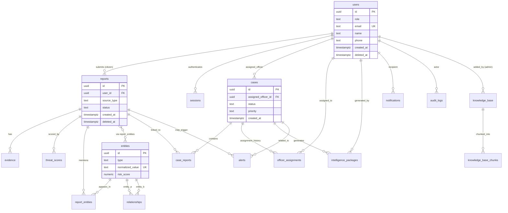

# Truvia
## Backend Schema Document
### v1.0 — Production-Ready Data Design

**Prepared by:** Principal Database Architect
**Source of truth:** Truvia PRD v1.0 (§13 Data Architecture), cross-referenced against TRD v1.0 §9 (Database Architecture)
**Scope note:** This document is data-only. No API contracts, no service/agent orchestration logic, no deployment topology — see the TRD for those. Where the PRD names a table only at a high level, this document expands it to full production DDL-equivalent detail: every column, type, nullability, default, constraint, index, and relationship.

---

## Table of Contents

1. Architecture Recap (Polyglot Persistence)
2. Entity-Relationship Diagram
3. Conventions Used Throughout This Schema
4. Relational Schema — Table Specifications
   4.1 `users`
   4.2 `sessions`
   4.3 `reports`
   4.4 `evidence`
   4.5 `threat_scores`
   4.6 `entities`
   4.7 `report_entities`
   4.8 `relationships`
   4.9 `cases`
   4.10 `case_reports`
   4.11 `officer_assignments`
   4.12 `knowledge_base`
   4.13 `knowledge_base_chunks`
   4.14 `alerts`
   4.15 `intelligence_packages`
   4.16 `notifications`
   4.17 `audit_logs`
   4.18 `settings`
5. Permissions & Ownership Model
6. Audit Logging Strategy
7. Soft Deletes
8. Versioning Strategy
9. Graph Database Schema (Neo4j)
10. Vector Database Schema (pgvector)
11. Optimization Strategies
12. Appendix: Full Constraint & Index Summary

---

## 1. Architecture Recap (Polyglot Persistence)

Per PRD §13, Truvia uses three coordinated stores, each responsible for exactly one class of query:

| Store | Role | Authoritative? |
|---|---|---|
| **PostgreSQL** | System of record — all transactional/relational data | **Yes** — the source of truth for every fact in the system |
| **Neo4j** | Derived correlation index — multi-hop entity traversal, ring clustering | No — mirrored from Postgres, rebuildable from it at any time |
| **pgvector** (extension inside the same Postgres instance) | Derived retrieval index — embeddings for RAG over the knowledge base | No — derived from `knowledge_base`/`knowledge_base_chunks` content |

This document specifies the Postgres schema in full (§4), then the Neo4j mirror schema (§9), then the vector schema living inside Postgres (§10). Nothing in Neo4j or the vector index should ever contain a fact that cannot be traced back to a Postgres row — this is what makes both derived stores safely rebuildable, per the TRD's cross-store consistency strategy.

---

## 2. Entity-Relationship Diagram



**Reading the diagram:** `reports` is the intake spine — everything a citizen submits. `cases` is investigation-level and deliberately decoupled from `reports` 1:1 (a case can span zero, one, or many reports via `case_reports`, since a ring-level investigation touches many reports at once — this mirrors PRD §13.1's note that `cases.report_id` is nullable for ring-level cases; this document formalizes that as a proper join table rather than a nullable FK, which is the production-correct version of that same idea). `entities` and `relationships` are the relational mirror of the graph store — authoritative in Postgres, replicated into Neo4j for traversal-shaped queries.

---

## 3. Conventions Used Throughout This Schema

These conventions apply to **every** table below unless explicitly overridden:

- **Primary keys:** `UUID`, generated via `gen_random_uuid()` (Postgres `pgcrypto`/`uuid-ossp`), never auto-increment integers — avoids leaking record counts/sequence in any exported evidence package, and avoids merge conflicts across the Postgres↔Neo4j mirror.
- **Timestamps:** always `timestamptz`, always UTC at the storage layer; `created_at` on every table; `updated_at` on every mutable table, maintained via an `updated_at` trigger, never set manually by application code.
- **Soft deletes:** every table that can be user-facing-deleted carries a nullable `deleted_at timestamptz`; hard deletes are never issued from application code (see §7).
- **Foreign keys:** `ON DELETE RESTRICT` by default (a fraud-intelligence platform must never silently cascade-delete evidence); explicit exceptions are called out per table.
- **JSON columns:** `jsonb`, never `json` (jsonb is indexable and more storage-efficient).
- **Enums:** implemented as Postgres `CHECK` constraints against a fixed text value set rather than native Postgres `ENUM` types — native enums are painful to alter under production migrations (a scam-category taxonomy that must grow over time); a `CHECK (col IN (...))` constraint is trivially alterable via a standard migration.
- **Naming:** snake_case throughout; FK columns named `<referenced_table_singular>_id`; join tables named `<table_a>_<table_b>` alphabetically or semantically (e.g., `report_entities`, `case_reports`).

---

## 4. Relational Schema — Table Specifications

### 4.1 `users`

**Purpose:** Every platform identity across all three roles (citizen, officer, admin) in one table, differentiated by `role` — avoids duplicating shared account fields (email, auth) across per-role tables, while `role` drives all authorization checks (see §5).

| Column | Type | Nullable | Default | Notes |
|---|---|---|---|---|
| `id` | `uuid` | No | `gen_random_uuid()` | PK |
| `role` | `text` | No | — | `CHECK (role IN ('citizen','officer','admin'))` |
| `email` | `text` | No | — | `UNIQUE`, citext recommended for case-insensitive match |
| `password_hash` | `text` | No | — | bcrypt/argon2 hash; never stored plaintext, never returned by any query used in app-facing responses |
| `name` | `text` | No | — | |
| `phone` | `text` | Yes | `NULL` | E.164 format enforced at application layer |
| `officer_badge_id` | `text` | Yes | `NULL` | Only populated when `role = 'officer'`; nullable for citizens/admins |
| `status` | `text` | No | `'active'` | `CHECK (status IN ('active','suspended','pending_invite'))` |
| `invited_by` | `uuid` | Yes | `NULL` | FK → `users.id`, `ON DELETE SET NULL`; tracks who invited an officer/admin account |
| `created_at` | `timestamptz` | No | `now()` | |
| `updated_at` | `timestamptz` | No | `now()` | trigger-maintained |
| `deleted_at` | `timestamptz` | Yes | `NULL` | soft delete |

**Constraints:** `UNIQUE (email)` (partial: `WHERE deleted_at IS NULL`, so a deleted account's email can be reused); `CHECK` on `role`; `CHECK` on `status`.

**Indexes:** `idx_users_email` (unique, partial on `deleted_at IS NULL`); `idx_users_role` (btree, for role-filtered admin queries); `idx_users_status` (btree, partial `WHERE status != 'active'` — this index only needs to be fast for the uncommon case).

**Relationships:** referenced by `reports.user_id`, `cases.assigned_officer_id`, `sessions.user_id`, `officer_assignments.officer_id`, `intelligence_packages.generated_by`, `notifications.user_id`, `audit_logs.actor_id`, `knowledge_base.added_by`.

---

### 4.2 `sessions`

**Purpose:** Server-side session/refresh-token tracking for JWT-based auth (TRD §8.1) — enables session revocation (logout-everywhere, suspend-account-force-logout) which a stateless-JWT-only design cannot support.

| Column | Type | Nullable | Default | Notes |
|---|---|---|---|---|
| `id` | `uuid` | No | `gen_random_uuid()` | PK |
| `user_id` | `uuid` | No | — | FK → `users.id`, `ON DELETE CASCADE` (a session is meaningless once its user is gone — this is the one intentional CASCADE exception in the schema, since sessions hold no independent evidentiary value) |
| `refresh_token_hash` | `text` | No | — | hashed, never the raw token |
| `device_label` | `text` | Yes | `NULL` | e.g. "Chrome on Windows" — shown on `/account/security` |
| `ip_address` | `inet` | Yes | `NULL` | |
| `issued_at` | `timestamptz` | No | `now()` | |
| `expires_at` | `timestamptz` | No | — | |
| `revoked_at` | `timestamptz` | Yes | `NULL` | set on logout or forced revocation |

**Constraints:** `CHECK (expires_at > issued_at)`.

**Indexes:** `idx_sessions_user_id` (btree); `idx_sessions_refresh_token_hash` (unique btree, lookup path for refresh); `idx_sessions_expires_at` (btree, partial `WHERE revoked_at IS NULL` — supports a scheduled cleanup job for expired sessions).

**Relationships:** child of `users`.

---

### 4.3 `reports`

**Purpose:** The intake spine of the whole product — every citizen submission (screenshot/audio/text), pre- and post-processing. This is the record the App Flow's `/fraud-shield/:reportId` screen renders.

| Column | Type | Nullable | Default | Notes |
|---|---|---|---|---|
| `id` | `uuid` | No | `gen_random_uuid()` | PK |
| `user_id` | `uuid` | No | — | FK → `users.id`, `ON DELETE RESTRICT` (a citizen's account must never be hard-deleted while their reports remain evidentiary records — anonymize instead, see §7) |
| `source_type` | `text` | No | — | `CHECK (source_type IN ('screenshot','audio','text'))` |
| `raw_input_ref` | `text` | No | — | object-storage reference (S3-style key), not the raw bytes |
| `cleaned_text` | `text` | Yes | `NULL` | Agent 1 output; nullable until pipeline completes |
| `detected_language` | `text` | Yes | `NULL` | ISO 639-1 code |
| `input_confidence` | `numeric(4,3)` | Yes | `NULL` | OCR/ASR confidence, 0.000–1.000 |
| `low_confidence_flag` | `boolean` | No | `false` | drives the degraded-mode UI banner (Design Brief §10.2) |
| `status` | `text` | No | `'submitted'` | `CHECK (status IN ('submitted','processing','scored','escalated','dismissed','failed'))` |
| `created_at` | `timestamptz` | No | `now()` | |
| `updated_at` | `timestamptz` | No | `now()` | |
| `deleted_at` | `timestamptz` | Yes | `NULL` | soft delete (citizen-initiated report withdrawal) |

**Constraints:** `CHECK` on `source_type`; `CHECK` on `status`; `CHECK (input_confidence IS NULL OR (input_confidence >= 0 AND input_confidence <= 1))`.

**Indexes:** `idx_reports_user_id` (btree); `idx_reports_status` (btree, for pipeline-monitoring/admin queries); `idx_reports_created_at` (btree, DESC — supports "recent reports feed" and time-range dashboard queries); composite `idx_reports_user_status` on `(user_id, status)` for the citizen History screen.

**Relationships:** parent of `evidence`, `threat_scores`, `report_entities`; referenced by `case_reports`, `alerts.related_report_id`.

---

### 4.4 `evidence`

**Purpose:** Raw artifact storage references and chain-of-custody metadata — kept separate from `reports` so a report can carry multiple evidence artifacts (e.g., a screenshot plus a follow-up voice note added later) without denormalizing storage pointers into the report row itself.

| Column | Type | Nullable | Default | Notes |
|---|---|---|---|---|
| `id` | `uuid` | No | `gen_random_uuid()` | PK |
| `report_id` | `uuid` | No | — | FK → `reports.id`, `ON DELETE RESTRICT` |
| `evidence_type` | `text` | No | — | `CHECK (evidence_type IN ('image','audio','text_paste','document'))` |
| `file_ref` | `text` | Yes | `NULL` | object-storage key; `NULL` for `text_paste` type, which stores content inline via `extraction_metadata_json` instead |
| `file_hash` | `text` | Yes | `NULL` | SHA-256 of the raw artifact — integrity/chain-of-custody hash, required for any non-`text_paste` type |
| `extraction_metadata_json` | `jsonb` | Yes | `NULL` | OCR bounding boxes, ASR timestamps, or raw pasted text |
| `created_at` | `timestamptz` | No | `now()` | |
| `deleted_at` | `timestamptz` | Yes | `NULL` | |

**Constraints:** `CHECK (evidence_type = 'text_paste' OR file_ref IS NOT NULL)` — enforces that any non-text evidence type actually has a storage reference; `CHECK (evidence_type = 'text_paste' OR file_hash IS NOT NULL)` — chain-of-custody hash is mandatory for file-based evidence.

**Indexes:** `idx_evidence_report_id` (btree); `idx_evidence_file_hash` (btree — supports duplicate-artifact detection across reports, useful for fraud-ring correlation on identical scam screenshots being recirculated).

**Relationships:** child of `reports`.

---

### 4.5 `threat_scores`

**Purpose:** Output of the Threat Detection Agent, **explicitly versioned** so re-scoring a report under a newer model never overwrites history — critical both for auditability ("what did the system say at the time this citizen acted on it") and for measuring model drift/improvement over time.

| Column | Type | Nullable | Default | Notes |
|---|---|---|---|---|
| `id` | `uuid` | No | `gen_random_uuid()` | PK |
| `report_id` | `uuid` | No | — | FK → `reports.id`, `ON DELETE RESTRICT` |
| `threat_score` | `smallint` | No | — | `CHECK (threat_score BETWEEN 0 AND 100)` |
| `severity_band` | `text` | No | — | `CHECK (severity_band IN ('low','moderate','high','critical'))` |
| `scam_category` | `text` | No | — | `CHECK` against a fixed taxonomy list (digital_arrest, upi_refund_scam, loan_app_harassment, investment_fraud, impersonation_authority, job_scam, sextortion, kyc_fraud, other) |
| `confidence_score` | `numeric(4,3)` | No | — | model certainty, `CHECK (confidence_score BETWEEN 0 AND 1)`, deliberately a **separate column from `threat_score`** per PRD's requirement that these never be conflated |
| `reasoning_json` | `jsonb` | No | — | structured explainability trace: flagged phrases, matched patterns, citations |
| `degraded_mode` | `boolean` | No | `false` | true when LLM call failed and rule-based-only fallback scoring was used |
| `model_version` | `text` | No | — | e.g. `"threat-detector-v2.3"` — the versioning key (see §8) |
| `is_current` | `boolean` | No | `true` | exactly one `TRUE` row per `report_id` at any time; older rows flip to `false` on re-score rather than being deleted |
| `created_at` | `timestamptz` | No | `now()` | |

**Constraints:** `CHECK` on `threat_score` range; `CHECK` on `severity_band`; `CHECK` on `confidence_score` range; partial `UNIQUE (report_id) WHERE is_current = true` — enforces the "exactly one current score" invariant at the database level, not just in application logic.

**Indexes:** `idx_threat_scores_report_id` (btree); `idx_threat_scores_current` (partial btree `WHERE is_current = true` — this is the index the dashboard/result-screen queries hit almost exclusively); `idx_threat_scores_severity` (btree, on `severity_band`, partial `WHERE is_current = true` — powers the Threat Score Distribution histogram and severity-filtered Complaint Table); GIN index on `reasoning_json` if free-text search over reasoning is ever needed (documented as a v2 optimization, not built for MVP scale).

**Relationships:** child of `reports`. Never referenced as a parent by anything else — it is a terminal/output record.

---

### 4.6 `entities`

**Purpose:** Master table of every extractable identifier (phone, UPI ID, email, domain, device fingerprint, IP, impersonated org name) — the relational mirror of Neo4j's `Entity` nodes (§9). This is the single most-queried table in Module 3.

| Column | Type | Nullable | Default | Notes |
|---|---|---|---|---|
| `id` | `uuid` | No | `gen_random_uuid()` | PK |
| `type` | `text` | No | — | `CHECK (type IN ('phone','upi','email','domain','device','ip','org'))` |
| `raw_value` | `text` | No | — | as first extracted, pre-normalization |
| `normalized_value` | `text` | No | — | canonicalized form (e.g., phone in E.164, domain lowercased) — **this is the actual de-duplication key** |
| `risk_score` | `numeric(5,2)` | No | `0` | aggregate risk, recomputed by Agent 5/graph algorithms; `CHECK (risk_score BETWEEN 0 AND 100)` |
| `risk_tier` | `text` | No | `'low'` | `CHECK (risk_tier IN ('low','moderate','high','critical'))`, kept as its own column (denormalized from `risk_score`) so severity-badge queries don't need a runtime bucket calculation |
| `first_seen_at` | `timestamptz` | No | `now()` | |
| `last_seen_at` | `timestamptz` | No | `now()` | updated every time this entity is re-extracted from a new report |
| `occurrence_count` | `integer` | No | `1` | denormalized counter, incremented on each new `report_entities` link — avoids a `COUNT(*)` aggregate on every entity-card render |
| `created_at` | `timestamptz` | No | `now()` | |
| `updated_at` | `timestamptz` | No | `now()` | |

**Constraints:** `UNIQUE (type, normalized_value)` — this is the core de-duplication constraint: the same UPI ID appearing in 40 reports is one `entities` row, not 40; `CHECK` on `type`; `CHECK` on `risk_tier`.

**Indexes:** `idx_entities_type_normalized` (unique btree, the constraint's backing index, also the primary lookup path for entity resolution during ingestion); `idx_entities_risk_tier` (btree, partial `WHERE risk_tier IN ('high','critical')` — powers "High-Risk Entities" KPI and Entity Explorer default sort); `idx_entities_last_seen` (btree DESC, for "recently active entities" queries); trigram (`pg_trgm`) index on `normalized_value` for fuzzy/partial search in the global search bar (Design Brief §17.1).

**Relationships:** parent of `report_entities`; both sides of `relationships` (`entity_id_a`, `entity_id_b`); mirrored as `Entity` nodes in Neo4j (§9).

---

### 4.7 `report_entities`

**Purpose:** Many-to-many join between `reports` and `entities` — every time an entity is extracted from a report, one row here records that specific occurrence (with its own confidence and source span), independent of the entity's aggregate stats in `entities`.

| Column | Type | Nullable | Default | Notes |
|---|---|---|---|---|
| `id` | `uuid` | No | `gen_random_uuid()` | PK (surrogate key, since a report could theoretically mention the same entity twice at different spans) |
| `report_id` | `uuid` | No | — | FK → `reports.id`, `ON DELETE RESTRICT` |
| `entity_id` | `uuid` | No | — | FK → `entities.id`, `ON DELETE RESTRICT` |
| `raw_span` | `text` | Yes | `NULL` | the exact substring as it appeared in `cleaned_text`, for evidentiary traceability |
| `extraction_confidence` | `numeric(4,3)` | No | — | `CHECK (extraction_confidence BETWEEN 0 AND 1)` |
| `created_at` | `timestamptz` | No | `now()` | |

**Constraints:** `UNIQUE (report_id, entity_id, raw_span)` — prevents true duplicate extraction rows while still allowing the same entity type/value to be legitimately mentioned via two different raw spans in one report.

**Indexes:** `idx_report_entities_report_id` (btree); `idx_report_entities_entity_id` (btree — this is the index behind "all reports mentioning this entity," the single most common Module 3 query, so it must be fast at scale).

**Relationships:** join table between `reports` and `entities`.

---

### 4.8 `relationships`

**Purpose:** Entity-to-entity edges — kept relationally as a backup/simple-query source even though the graph store (§9) is the primary engine for traversal. Per PRD §13.1, this exists for "backup/query simplicity," not as the primary correlation engine.

| Column | Type | Nullable | Default | Notes |
|---|---|---|---|---|
| `id` | `uuid` | No | `gen_random_uuid()` | PK |
| `entity_id_a` | `uuid` | No | — | FK → `entities.id`, `ON DELETE RESTRICT` |
| `entity_id_b` | `uuid` | No | — | FK → `entities.id`, `ON DELETE RESTRICT` |
| `relationship_type` | `text` | No | — | `CHECK` against fixed set: `same_phone_used_in`, `same_upi_linked_to`, `same_script_pattern_as`, `co_occurred_with`, `same_device_as` |
| `strength` | `numeric(4,3)` | No | `1.0` | co-occurrence weight, `CHECK (strength BETWEEN 0 AND 1)` |
| `evidence_report_id` | `uuid` | Yes | `NULL` | FK → `reports.id`, `ON DELETE SET NULL` — the report that first established this relationship, where applicable |
| `created_at` | `timestamptz` | No | `now()` | |

**Constraints:** `CHECK (entity_id_a <> entity_id_b)` — no self-relationships; `CHECK (entity_id_a < entity_id_b)` — canonical ordering to prevent duplicate A→B / B→A rows representing the same undirected relationship; `UNIQUE (entity_id_a, entity_id_b, relationship_type)`.

**Indexes:** `idx_relationships_entity_a` (btree); `idx_relationships_entity_b` (btree); composite `idx_relationships_type` on `(relationship_type, strength DESC)`.

**Relationships:** self-referencing on `entities`; mirrored as `LINKED_TO` edges in Neo4j.

---

### 4.9 `cases`

**Purpose:** Investigation-level tracking — deliberately decoupled from individual reports (a case can represent one report or an entire ring investigation spanning many). This is what an officer opens as the Investigation View.

| Column | Type | Nullable | Default | Notes |
|---|---|---|---|---|
| `id` | `uuid` | No | `gen_random_uuid()` | PK |
| `case_number` | `text` | No | — | human-readable, e.g. `"CASE-2026-04821"`, generated sequentially per year via a Postgres sequence; `UNIQUE` |
| `case_type` | `text` | No | — | `CHECK (case_type IN ('single_report','ring_level'))` |
| `assigned_officer_id` | `uuid` | Yes | `NULL` | FK → `users.id`, `ON DELETE SET NULL` — current assignment only; full history lives in `officer_assignments` |
| `status` | `text` | No | `'open'` | `CHECK (status IN ('open','in_review','escalated','closed'))` |
| `priority` | `text` | No | `'medium'` | `CHECK (priority IN ('low','medium','high','urgent'))` |
| `ai_summary` | `text` | Yes | `NULL` | LLM-generated case brief, regenerable |
| `neo4j_ring_id` | `text` | Yes | `NULL` | reference to the corresponding `Ring` node in Neo4j, when `case_type = 'ring_level'` |
| `created_at` | `timestamptz` | No | `now()` | |
| `updated_at` | `timestamptz` | No | `now()` | |
| `closed_at` | `timestamptz` | Yes | `NULL` | |
| `deleted_at` | `timestamptz` | Yes | `NULL` | |

**Constraints:** `UNIQUE (case_number)`; `CHECK` on `case_type`, `status`, `priority`; `CHECK (closed_at IS NULL OR status = 'closed')`.

**Indexes:** `idx_cases_assigned_officer` (btree, partial `WHERE status != 'closed'` — this is the "My Cases" screen's primary query); `idx_cases_status_priority` (composite, on `(status, priority)` — powers dashboard triage sort); `idx_cases_case_number` (unique btree).

**Relationships:** parent of `case_reports`, `officer_assignments`, `intelligence_packages`; referenced by `alerts.related_case_id`.

---

### 4.10 `case_reports`

**Purpose:** Join table linking a case to every report it encompasses — the production-correct replacement for a nullable `cases.report_id`, supporting the ring-level "many reports, one case" pattern cleanly.

| Column | Type | Nullable | Default | Notes |
|---|---|---|---|---|
| `case_id` | `uuid` | No | — | FK → `cases.id`, `ON DELETE CASCADE` (if a case record is ever purged, its link rows are meaningless without it — but note `cases` itself is never hard-deleted in practice, see §7) |
| `report_id` | `uuid` | No | — | FK → `reports.id`, `ON DELETE RESTRICT` |
| `linked_at` | `timestamptz` | No | `now()` | |
| `linked_reason` | `text` | Yes | `NULL` | e.g. `"entity correlation: UPI ID match"` — free text explaining why this report was pulled into the case |

**Constraints:** Composite PK `(case_id, report_id)`.

**Indexes:** `idx_case_reports_report_id` (btree, for "which case(s) is this report part of" lookups).

**Relationships:** join table between `cases` and `reports`.

---

### 4.11 `officer_assignments`

**Purpose:** Full assignment history for a case — `cases.assigned_officer_id` only shows the *current* assignee; this table is the append-only audit trail of every assignment/reassignment, required for accountability in an evidentiary system.

| Column | Type | Nullable | Default | Notes |
|---|---|---|---|---|
| `id` | `uuid` | No | `gen_random_uuid()` | PK |
| `case_id` | `uuid` | No | — | FK → `cases.id`, `ON DELETE RESTRICT` |
| `officer_id` | `uuid` | No | — | FK → `users.id`, `ON DELETE RESTRICT` |
| `assigned_by` | `uuid` | No | — | FK → `users.id`, `ON DELETE RESTRICT` — who performed the assignment (self-assign or admin/officer reassignment) |
| `assigned_at` | `timestamptz` | No | `now()` | |
| `unassigned_at` | `timestamptz` | Yes | `NULL` | set when superseded by a later assignment |

**Constraints:** none beyond FKs — this table is intentionally append-only, no `UNIQUE` constraint restricting re-assignment history.

**Indexes:** `idx_officer_assignments_case_id` (btree); `idx_officer_assignments_officer_id` (btree, partial `WHERE unassigned_at IS NULL` — "what's currently assigned to me").

**Relationships:** child of `cases` and `users`.

---

### 4.12 `knowledge_base`

**Purpose:** Source regulatory documents (RBI/MHA/NCRP/CERT-In/NPCI/custom) that ground every AI Chat Assistant citation and Threat Detection Agent reasoning reference.

| Column | Type | Nullable | Default | Notes |
|---|---|---|---|---|
| `id` | `uuid` | No | `gen_random_uuid()` | PK |
| `source` | `text` | No | — | `CHECK (source IN ('RBI','MHA','NCRP','CERT-In','NPCI','custom'))` |
| `title` | `text` | No | — | |
| `content` | `text` | No | — | full document text, pre-chunking |
| `source_url` | `text` | Yes | `NULL` | original publication URL, where applicable |
| `added_by` | `uuid` | No | — | FK → `users.id`, `ON DELETE RESTRICT` — admin who added it |
| `status` | `text` | No | `'processing'` | `CHECK (status IN ('processing','indexed','failed'))` |
| `version` | `integer` | No | `1` | incremented on content replacement (see §8) |
| `ingested_at` | `timestamptz` | No | `now()` | |
| `updated_at` | `timestamptz` | No | `now()` | |
| `deleted_at` | `timestamptz` | Yes | `NULL` | |

**Constraints:** `CHECK` on `source`; `CHECK` on `status`.

**Indexes:** `idx_knowledge_base_source` (btree); `idx_knowledge_base_status` (btree, partial `WHERE status != 'indexed'` — supports the Admin console's processing-status polling).

**Relationships:** parent of `knowledge_base_chunks`.

---

### 4.13 `knowledge_base_chunks`

**Purpose:** Chunked, embedded segments of each `knowledge_base` document — this is the table pgvector similarity search actually queries (see §10). Kept as a distinct child table (rather than a single-embedding-per-document design) because RAG retrieval quality depends on chunk-level, not document-level, granularity.

| Column | Type | Nullable | Default | Notes |
|---|---|---|---|---|
| `id` | `uuid` | No | `gen_random_uuid()` | PK |
| `knowledge_base_id` | `uuid` | No | — | FK → `knowledge_base.id`, `ON DELETE CASCADE` (a chunk has no independent meaning once its source document is removed — intentional exception to the default RESTRICT policy) |
| `chunk_index` | `integer` | No | — | ordinal position within the document |
| `chunk_text` | `text` | No | — | the actual chunked content, roughly 300–500 tokens per chunk |
| `embedding` | `vector(1536)` | No | — | pgvector column; dimension matches the chosen embedding model (see §10) |
| `embedding_model_version` | `text` | No | — | e.g. `"embed-v1"` — required for safe re-embedding when the model changes (§8) |
| `token_count` | `integer` | Yes | `NULL` | for cost/context-window accounting |
| `created_at` | `timestamptz` | No | `now()` | |

**Constraints:** `UNIQUE (knowledge_base_id, chunk_index, embedding_model_version)` — allows multiple embedding-model generations of the same chunk to coexist during a migration window (§8), while still preventing true duplicates.

**Indexes:** `idx_kb_chunks_document` (btree on `knowledge_base_id`); **HNSW vector index** on `embedding` (`USING hnsw (embedding vector_cosine_ops)`) — the primary similarity-search index, detailed in §10.

**Relationships:** child of `knowledge_base`.

---

### 4.14 `alerts`

**Purpose:** Generated alerts surfaced in dashboards — both the citizen-facing "Public Scam Alerts" feed and the officer-facing "Emerging Scam Trends" panel, differentiated by `scope`.

| Column | Type | Nullable | Default | Notes |
|---|---|---|---|---|
| `id` | `uuid` | No | `gen_random_uuid()` | PK |
| `scope` | `text` | No | — | `CHECK (scope IN ('public','officer'))` |
| `title` | `text` | No | — | |
| `description` | `text` | No | — | |
| `severity` | `text` | No | — | `CHECK (severity IN ('low','moderate','high','critical'))` |
| `related_case_id` | `uuid` | Yes | `NULL` | FK → `cases.id`, `ON DELETE SET NULL` |
| `related_report_id` | `uuid` | Yes | `NULL` | FK → `reports.id`, `ON DELETE SET NULL` |
| `velocity_metric` | `jsonb` | Yes | `NULL` | e.g. `{"count_7d": 14, "trend_pct": 40}` — backs the "+40% this week" trend indicator |
| `is_active` | `boolean` | No | `true` | flipped false when a trend cools down, rather than deleting the historical alert |
| `created_at` | `timestamptz` | No | `now()` | |
| `expires_at` | `timestamptz` | Yes | `NULL` | optional auto-expiry for time-boxed alerts |

**Constraints:** `CHECK` on `scope`; `CHECK` on `severity`.

**Indexes:** `idx_alerts_scope_active` (composite on `(scope, is_active)` — the exact filter behind both feed queries); `idx_alerts_created_at` (btree DESC).

**Relationships:** optionally references `cases` and `reports`.

---

### 4.15 `intelligence_packages`

**Purpose:** Immutable, generated court-ready packages — the terminal output artifact of an investigation. Immutability here is a legal/evidentiary requirement, not just a data-modeling preference: once generated, a package must never be edited, only regenerated as a new versioned row.

| Column | Type | Nullable | Default | Notes |
|---|---|---|---|---|
| `id` | `uuid` | No | `gen_random_uuid()` | PK |
| `case_id` | `uuid` | No | — | FK → `cases.id`, `ON DELETE RESTRICT` |
| `package_json` | `jsonb` | No | — | full structured snapshot: entities, timeline, linked complaints, evidence hashes, threat scores at time of generation |
| `package_type` | `text` | No | — | `CHECK (package_type IN ('case_level','ring_level'))` |
| `content_hash` | `text` | No | — | SHA-256 of `package_json`, for tamper-evidence |
| `pdf_ref` | `text` | Yes | `NULL` | object-storage reference to the rendered PDF |
| `version` | `integer` | No | `1` | incremented per regeneration for the same case (§8) |
| `generated_by` | `uuid` | No | — | FK → `users.id`, `ON DELETE RESTRICT` |
| `generated_at` | `timestamptz` | No | `now()` | |

**Constraints:** No `UPDATE` permission granted at the application-role level (see §5) — this table is insert-only after creation, enforced by database role grants, not merely application convention; `UNIQUE (case_id, version)`.

**Indexes:** `idx_intelligence_packages_case_id` (btree); `idx_intelligence_packages_generated_at` (btree DESC).

**Relationships:** child of `cases` and `users`.

---

### 4.16 `notifications`

**Purpose:** In-app notification records backing the header notification bell (Design Brief §17.1) — distinct from the transient toast pattern (which is a UI-only, non-persisted concept); this table is the durable record of "a new emerging trend fired" or "your package is ready."

| Column | Type | Nullable | Default | Notes |
|---|---|---|---|---|
| `id` | `uuid` | No | `gen_random_uuid()` | PK |
| `user_id` | `uuid` | No | — | FK → `users.id`, `ON DELETE CASCADE` (a notification has no independent value without its recipient) |
| `type` | `text` | No | — | `CHECK (type IN ('emerging_trend','package_ready','case_assigned','report_scored','system'))` |
| `title` | `text` | No | — | |
| `body` | `text` | Yes | `NULL` | |
| `related_entity_type` | `text` | Yes | `NULL` | polymorphic reference type: `'case'`, `'report'`, `'alert'`, `'package'` |
| `related_entity_id` | `uuid` | Yes | `NULL` | polymorphic reference id — deliberately not a strict FK (would require one column per referenceable table); application layer resolves the join based on `related_entity_type` |
| `read_at` | `timestamptz` | Yes | `NULL` | |
| `created_at` | `timestamptz` | No | `now()` | |

**Constraints:** `CHECK` on `type`.

**Indexes:** `idx_notifications_user_unread` (composite btree on `(user_id, read_at)`, partial `WHERE read_at IS NULL` — the exact query behind the notification-bell badge count).

**Relationships:** child of `users`; polymorphic soft-reference to other tables (documented, not FK-enforced).

---

### 4.17 `audit_logs`

**Purpose:** Generic, append-only record of every security- and evidence-relevant action across the platform — who did what, to what, when. This is a single unified table rather than per-table audit trails, per the standard production pattern for auditability that must survive schema evolution (see §6 for full design rationale).

| Column | Type | Nullable | Default | Notes |
|---|---|---|---|---|
| `id` | `uuid` | No | `gen_random_uuid()` | PK |
| `actor_id` | `uuid` | Yes | `NULL` | FK → `users.id`, `ON DELETE SET NULL` — nullable to permit system/agent-initiated actions with no human actor |
| `actor_type` | `text` | No | `'user'` | `CHECK (actor_type IN ('user','system','agent'))` |
| `action` | `text` | No | — | e.g. `'case.assign'`, `'report.escalate'`, `'package.generate'`, `'user.suspend'` — a controlled vocabulary, documented in an application-level enum, not DB-enforced (grows too often for a hard `CHECK` list) |
| `entity_type` | `text` | No | — | the table name the action targeted, e.g. `'cases'` |
| `entity_id` | `uuid` | No | — | the targeted row's id (soft polymorphic reference, same rationale as `notifications`) |
| `diff_json` | `jsonb` | Yes | `NULL` | before/after snapshot of changed fields, where applicable |
| `ip_address` | `inet` | Yes | `NULL` | |
| `created_at` | `timestamptz` | No | `now()` | |

**Constraints:** none beyond FK/CHECK above — deliberately unconstrained/append-only; no `updated_at`, no soft-delete column (an audit log row is never edited or deleted by design).

**Indexes:** `idx_audit_logs_entity` (composite on `(entity_type, entity_id)` — "show me the full history of this case"); `idx_audit_logs_actor` (btree on `actor_id`); `idx_audit_logs_created_at` (btree DESC, and a candidate for range partitioning at scale — see §11).

**Relationships:** soft-references `users` and, polymorphically, any other table.

---

### 4.18 `settings`

**Purpose:** Small, low-write-volume system configuration table — thresholds, feature flags, and tunable parameters that should be adjustable without a code deploy (e.g., the Louvain clustering resolution threshold mentioned as an open question in PRD Appendix C, or the low-confidence OCR/ASR threshold).

| Column | Type | Nullable | Default | Notes |
|---|---|---|---|---|
| `key` | `text` | No | — | PK, e.g. `'ocr_low_confidence_threshold'` |
| `value_json` | `jsonb` | No | — | typed value, interpreted by the consuming service |
| `description` | `text` | Yes | `NULL` | human-readable explanation, shown in the admin settings UI |
| `updated_by` | `uuid` | Yes | `NULL` | FK → `users.id`, `ON DELETE SET NULL` |
| `updated_at` | `timestamptz` | No | `now()` | |

**Constraints:** PK on `key` (natural key, appropriate here since settings are a small, named, admin-curated set rather than a growing record collection).

**Indexes:** none beyond the PK — table is small enough (dozens of rows) that no secondary index is warranted.

**Relationships:** soft-references `users` via `updated_by`.

---

## 5. Permissions & Ownership Model

### 5.1 Role-Based Access Matrix

| Table | Citizen | Officer | Admin |
|---|---|---|---|
| `users` | Read/update **own row only** | Read own row; read officer directory (name/badge only) | Full CRUD |
| `sessions` | Own rows only | Own rows only | Own rows only + can force-revoke any user's sessions |
| `reports` | Full CRUD on **own** reports only | Read all | Read all |
| `evidence` | Read own (via owned report) | Read all | Read all |
| `threat_scores` | Read own (via owned report) | Read all | Read all |
| `entities` | No access | Read all | Read all + edit `risk_tier` overrides |
| `report_entities` | No access | Read all | Read all |
| `relationships` | No access | Read all | Read all |
| `cases` | No access | Read/update assigned + unassigned open cases; assign to self | Full CRUD |
| `case_reports` | No access | Read (scoped to accessible cases) | Full CRUD |
| `officer_assignments` | No access | Read own assignment history | Full CRUD |
| `knowledge_base` | No access (consumed only via the RAG chat, never browsed directly) | Read | Full CRUD |
| `knowledge_base_chunks` | No access | No direct access (query-only via RAG service account) | No direct access |
| `alerts` | Read `scope='public'` only | Read all | Full CRUD |
| `intelligence_packages` | No access | Create (for accessible cases); read own-generated + assigned-case packages | Full CRUD |
| `notifications` | Own rows only | Own rows only | Own rows only |
| `audit_logs` | No access | No access | Read-only (append-only even for admin — no `UPDATE`/`DELETE` grant to any role) |
| `settings` | No access | Read-only where relevant (e.g., displayed thresholds) | Full CRUD |

### 5.2 Enforcement Mechanism

Enforced at **two layers**, deliberately redundant:

1. **Application layer** (FastAPI dependency-injected role guards) — the primary, feature-rich enforcement point, able to express "officer can read a case only if assigned or unassigned" logic that's awkward in pure SQL.
2. **Database layer** (PostgreSQL Row-Level Security policies on `reports`, `cases`, `intelligence_packages`, `notifications`) — a defense-in-depth backstop so a bug in application-layer logic (e.g., a missing `WHERE user_id = :current_user` clause) cannot leak another citizen's report data even if application code is compromised or buggy. RLS policies are written against a `current_setting('app.current_user_id')` session variable set at the start of each request-scoped database transaction.

### 5.3 Ownership Model

- **Citizens own their reports** (`reports.user_id`) — this is the only true "ownership" relationship in the schema and the one RLS policy that is non-negotiable to get right (a citizen must never be able to read another citizen's report, screenshot, call transcript, or threat score under any circumstance).
- **Officers do not "own" cases** in the same exclusive sense — `cases.assigned_officer_id` is a workflow-routing field, not an access-control boundary; any officer can read any case (per PRD's single-tenant-status-field MVP design, with full RBAC deferred to v2), assignment only affects who a case shows up for by default and who can generate packages against it without an override.
- **Admin is a superset role**, never a separate data silo — Admin's elevated access is expressed entirely through role-check logic (§5.1), not through a parallel data model.

---

## 6. Audit Logging Strategy

- **Single unified `audit_logs` table**, not per-table shadow/history tables — chosen because Truvia's audit requirement is fundamentally "who did what to what, when" across a *product surface* (assignments, escalations, package generation, account suspension), not a full field-level change-history requirement for every table (which would call for a trigger-based `*_history` table per mutable table instead). A unified log is also what a court-ready export process most naturally consumes: one chronological feed, filterable by `entity_type`/`entity_id`.
- **What gets logged:** every state-changing action reachable from the App Flow's dialog inventory (§10 in App Flow) — case assignment/reassignment, intelligence package generation, report escalation, account suspend/reactivate, knowledge base document add/remove, settings changes. Read-only actions (viewing a dashboard) are **not** logged here — that volume belongs in application/request logs (TRD §12), not the audit trail.
- **Immutability:** `audit_logs` has no `UPDATE` or `DELETE` grant issued to any database role, including the application's own service role beyond `INSERT` — enforced identically to `intelligence_packages`. If a correction is ever needed, a new compensating log row is inserted; the original is never altered.
- **Retention:** audit logs are retained indefinitely (a fraud-intelligence platform's audit trail is itself potential evidence) — this is the primary driver for the partitioning strategy in §11.

---

## 7. Soft Deletes

- **Convention:** a nullable `deleted_at timestamptz` column on every user-facing, potentially-deletable table (`users`, `reports`, `evidence`, `cases`, `knowledge_base`). A row with `deleted_at IS NOT NULL` is excluded from all default application queries via a shared query-builder base filter, but remains physically present in the database.
- **Why soft, never hard, deletes here specifically:** this is an evidentiary platform — a citizen "withdrawing" a report, or an admin "removing" a knowledge base document, must not destroy the underlying record if it has already contributed to a threat score, an entity extraction, or a generated intelligence package that references it. Hard deletion would silently corrupt the immutability guarantee on `intelligence_packages` and the historical accuracy of `audit_logs`.
- **Explicit non-soft-delete tables:** `threat_scores`, `intelligence_packages`, `audit_logs`, `officer_assignments` are **never deleted at all**, soft or hard — they are append-only/versioned by design (§8), which is a stronger guarantee than soft-delete.
- **Citizen right-to-erasure exception:** where a citizen exercises a legal data-deletion right, the correct operation is **anonymization**, not deletion — `users.name`/`phone`/`email` are overwritten with tokenized placeholders while `reports`/`threat_scores`/`entities` rows remain intact (since the fraud-intelligence value of an extracted entity is independent of which citizen reported it). This is a documented application-layer procedure, not a schema feature per se, but the schema is designed to support it cleanly (no cascading deletes exist that would remove evidentiary rows when a `users` row is anonymized).

---

## 8. Versioning Strategy

Three distinct versioning patterns are used, matched to three distinct needs:

| Pattern | Used By | Mechanism |
|---|---|---|
| **Current-flag versioning** | `threat_scores` | New score → new row, old row's `is_current` flips to `false`. Full history preserved; "what does the citizen see right now" is a fast partial-index lookup. |
| **Monotonic version counter** | `knowledge_base` (`version` column), `intelligence_packages` (`version` column) | Each edit/regeneration increments an integer; old versions are retained (packages are literally immutable per version, per §4.15; knowledge base documents keep prior versions so historical chat citations remain traceable to what was actually indexed at the time). |
| **Model-version tagging (no row versioning)** | `threat_scores.model_version`, `knowledge_base_chunks.embedding_model_version` | The row itself isn't "versioned" in the sense of having multiple copies — instead, every scored/embedded row is tagged with the exact model that produced it, so a model upgrade never silently reinterprets old data as if it came from the new model. |

**Why this matters for `knowledge_base_chunks` specifically:** when the embedding model is upgraded, old embeddings are **not deleted or overwritten in place** — new rows are inserted with the new `embedding_model_version`, and the RAG retrieval service is configured to query only the current production model version via a `WHERE embedding_model_version = :active_version` filter (itself sourced from `settings`). This allows a zero-downtime embedding migration: re-embed in the background, flip the `settings` pointer, then garbage-collect old-version rows on a delay — never a blocking in-place rewrite of the vector index.

---

## 9. Graph Database Schema (Neo4j)

Per PRD §13.2 and TRD §9.2, Neo4j is a **derived correlation index** — never the sole holder of any fact. Every node and edge below has a direct Postgres origin.

### 9.1 Node Types

| Label | Mirrors | Key Properties | Notes |
|---|---|---|---|
| `Entity` | `entities` (Postgres) | `id` (= Postgres `entities.id`, kept identical across stores for direct join-back), `type`, `normalized_value`, `risk_score`, `risk_tier`, `occurrence_count` | Typed sub-labels also applied: `:Entity:Phone`, `:Entity:UPI`, `:Entity:Email`, `:Entity:Domain`, `:Entity:Device`, `:Entity:IP`, `:Entity:Org` — dual-labeling lets Cypher queries filter by type without a property-equality scan |
| `Report` | `reports` (Postgres) | `id`, `created_at`, `scam_category` (denormalized from `threat_scores` for fast graph-side filtering without a cross-store join), `severity_band` | Kept intentionally thin — Report nodes exist to anchor `CO_OCCURRED_IN` edges, not to duplicate the full report record |
| `Ring` | derived (no direct Postgres table — computed by community detection, referenced back via `cases.neo4j_ring_id`) | `id`, `detected_at`, `algorithm_version`, `member_count`, `dominant_category` | The one node type that originates *in* Neo4j rather than being mirrored *into* it — but its existence is always subsequently written back to a `cases` row once promoted to an investigation, closing the loop |

### 9.2 Edge Types

| Type | Direction | Mirrors | Properties | Notes |
|---|---|---|---|---|
| `CO_OCCURRED_IN` | `Entity → Report` | `report_entities` (Postgres) | `extraction_confidence`, `raw_span` | Written in the same pipeline stage as the Postgres `report_entities` insert (Agent 5), keeping the two stores in sub-second sync per TRD §9.4 |
| `LINKED_TO` | `Entity ↔ Entity` (modeled as directed with a `symmetric: true` property, since Neo4j has no native undirected edge) | `relationships` (Postgres) | `relationship_type`, `strength`, `evidence_report_id` | The primary traversal edge for "N-hop entity correlation" queries |
| `MEMBER_OF` | `Entity → Ring` | derived (no direct Postgres mirror; written when clustering runs) | `membership_confidence`, `assigned_at` | Created/updated by the Louvain community-detection job, not by the ingestion pipeline |
| `SIMILAR_SCRIPT_TO` | `Report ↔ Report` | derived (computed via text-similarity scoring, not a direct Postgres table) | `similarity_score`, `computed_at` | Distinct from entity-based correlation — this edge exists even when two reports share no extracted entity at all, catching scam-script reuse across otherwise-unlinked reports |

### 9.3 Indexes & Constraints (Neo4j)

```cypher
// Uniqueness constraints (also auto-create a backing index)
CREATE CONSTRAINT entity_id_unique IF NOT EXISTS
  FOR (e:Entity) REQUIRE e.id IS UNIQUE;

CREATE CONSTRAINT report_id_unique IF NOT EXISTS
  FOR (r:Report) REQUIRE r.id IS UNIQUE;

CREATE CONSTRAINT ring_id_unique IF NOT EXISTS
  FOR (g:Ring) REQUIRE g.id IS UNIQUE;

// Property indexes for common filter/lookup paths
CREATE INDEX entity_normalized_value IF NOT EXISTS
  FOR (e:Entity) ON (e.normalized_value);

CREATE INDEX entity_risk_tier IF NOT EXISTS
  FOR (e:Entity) ON (e.risk_tier);

CREATE INDEX report_created_at IF NOT EXISTS
  FOR (r:Report) ON (r.created_at);

// Full-text index, supporting the global search bar's entity lookup
CREATE FULLTEXT INDEX entity_search IF NOT EXISTS
  FOR (e:Entity) ON EACH [e.normalized_value];
```

### 9.4 Representative Queries (illustrating why the graph store exists)

```cypher
// "Entities within 2 hops of this UPI ID" — the query PRD §5 cites
// as impossible to run efficiently in pure relational form at scale
MATCH (start:Entity {normalized_value: $upiId})
MATCH (start)-[:LINKED_TO*1..2]-(related:Entity)
RETURN DISTINCT related
ORDER BY related.risk_score DESC;

// Fraud ring detection (Louvain community detection via GDS library)
CALL gds.louvain.stream('entity-graph-projection')
YIELD nodeId, communityId
RETURN gds.util.asNode(nodeId).normalized_value AS entity, communityId
ORDER BY communityId;
```

### 9.5 Sync & Rebuild Guarantee

Because every `Entity`/`Report` node and `CO_OCCURRED_IN`/`LINKED_TO` edge has a direct Postgres source, the entire graph (excluding the derived `Ring` nodes and `MEMBER_OF`/`SIMILAR_SCRIPT_TO` edges, which are themselves recomputable from Postgres + the clustering algorithm) can be **fully rebuilt from Postgres** via a replay job — this is the operational safety net that justifies running a second database system at all (TRD §9.2).

---

## 10. Vector Database Schema (pgvector)

Per PRD §13.3/TRD §9.3, the vector store lives as the `pgvector` extension inside the same Postgres instance — no separate vector database service. Its schema is the `knowledge_base_chunks` table (§4.13) plus the index/query strategy below.

### 10.1 Embeddings

- **Model:** a single embedding model per active `embedding_model_version` (documented in `settings`), producing fixed-dimension vectors — `vector(1536)` sized for a typical modern embedding model; adjust the column dimension to match whichever provider is finalized (per TRD's provider-agnostic LLM abstraction layer).
- **Distance metric:** cosine similarity (`vector_cosine_ops`) — the standard choice for text embeddings, since magnitude is not semantically meaningful for normalized sentence embeddings.
- **What is embedded:** `knowledge_base_chunks.chunk_text` only — never raw citizen report content, which stays out of the vector index entirely (the RAG system grounds answers in regulatory guidance, not in other citizens' report data, both for privacy and because that's the actual product requirement per PRD §8.1).

### 10.2 Metadata

Every embedding row carries enough relational metadata to answer "where did this citation come from" without a second lookup:

```sql
-- Representative similarity query used by the RAG service (Agent 3)
SELECT
    kbc.chunk_text,
    kbc.chunk_index,
    kb.source,
    kb.title,
    kb.source_url,
    1 - (kbc.embedding <=> $queryEmbedding) AS similarity
FROM knowledge_base_chunks kbc
JOIN knowledge_base kb ON kb.id = kbc.knowledge_base_id
WHERE kbc.embedding_model_version = (
    SELECT value_json->>'active_version' FROM settings WHERE key = 'embedding_model_version'
)
AND kb.deleted_at IS NULL
ORDER BY kbc.embedding <=> $queryEmbedding
LIMIT 5;
```

The `source`/`title`/`source_url` join is exactly what powers the citation chips in the Citizen Fraud Shield's AI Chat Assistant and the officer-facing AI Summary (Design Brief §14.4/§15.3) — every retrieved chunk is traceable back to a named, versioned regulatory document, never an anonymous embedding.

### 10.3 Chunking Strategy

- **Chunk size:** ~300–500 tokens per chunk, with a ~50-token overlap between consecutive chunks (`chunk_index` ordering preserved) — overlap prevents a citation-worthy sentence from being split exactly at a chunk boundary and losing surrounding context.
- **Chunking boundary preference:** paragraph/section boundaries where the source document has them (regulatory advisories are usually well-structured with numbered clauses), falling back to sentence-boundary splitting for unstructured source text — never a hard token-count cut mid-sentence.
- **Re-chunking triggers:** a `knowledge_base` document update (new `version`) triggers full re-chunking and re-embedding of that document only — chunks are never partially patched in place, since chunk boundaries can shift with any content edit, invalidating `chunk_index` continuity.

### 10.4 Indexing

```sql
CREATE INDEX idx_kb_chunks_embedding_hnsw
  ON knowledge_base_chunks
  USING hnsw (embedding vector_cosine_ops)
  WITH (m = 16, ef_construction = 64);
```

**HNSW chosen over IVFFlat** for this workload specifically because the knowledge base corpus is small (regulatory documents, not millions of user documents, per PRD §14's explicit scoping rationale) and query latency matters more than build time at this scale — HNSW gives better recall/latency at small-to-medium corpus sizes without needing the `lists` parameter tuning IVFFlat requires as data grows. Revisit only if the corpus later grows to a scale where HNSW's memory footprint becomes a constraint (documented as a v2 concern, not an MVP one).

### 10.5 Versioning (cross-reference to §8)

Embeddings are versioned via `embedding_model_version`, never re-generated in place. A model upgrade is a background re-embed job writing new rows, followed by a `settings` pointer flip, followed by a delayed cleanup of the prior version's rows — ensuring the RAG service never serves a response mixing embeddings from two different models mid-query.

---

## 11. Optimization Strategies

### 11.1 Read-Path Optimization

- **Materialized views for dashboard aggregates** (per TRD §9.1): `mv_dashboard_kpis`, `mv_complaint_trends_daily`, `mv_threat_score_distribution` — refreshed on a scheduled background job (e.g., every 2–5 minutes), not computed live on every KPI-card render. This is the single highest-leverage optimization in the schema: it decouples dashboard response time from report-table growth entirely.
- **Denormalized counters** (`entities.occurrence_count`, `entities.risk_tier`) avoid `COUNT(*)`/bucket-calculation aggregates on every entity-card or badge render — maintained via the ingestion pipeline's write path, not recomputed per-read.
- **Partial indexes** used throughout (e.g., `idx_threat_scores_current`, `idx_cases_assigned_officer WHERE status != 'closed'`) — keep index size proportional to the *actively queried* subset of a table rather than its full historical size, which matters once `threat_scores`/`audit_logs` accumulate years of history.

### 11.2 Write-Path Optimization

- **Async, queue-mediated writes** (per TRD §4.2/§13.2) mean the schema itself never needs to optimize for peak-burst write throughput on the hot path — reports are accepted fast, then processed (and their downstream `threat_scores`/`entities`/graph writes) asynchronously.
- **Bulk entity upsert pattern:** entity resolution during ingestion uses `INSERT ... ON CONFLICT (type, normalized_value) DO UPDATE SET last_seen_at = now(), occurrence_count = entities.occurrence_count + 1` — a single upsert statement rather than a read-then-write round trip, reducing lock contention on frequently-recurring high-risk entities (a phone number appearing in its 200th complaint should not require read-modify-write latency to grow).

### 11.3 Partitioning Strategy (post-hackathon / production scale)

- `audit_logs` and `threat_scores` are the two tables designed for **range partitioning by `created_at`** (monthly partitions) once volume warrants it — both are append-mostly, time-ordered, and queried predominantly by recent-date ranges, making them ideal partitioning candidates. This is documented as the schema's designated growth lever, not built at hackathon scale (matching the PRD's stated philosophy of documenting the production-scale path rather than over-building for demo-scale data).
- `reports` is a partitioning candidate at a later growth stage (by `created_at`, yearly), but is deliberately **not partitioned at MVP scale** (150–300 seeded rows per PRD §6) — partitioning a table this small adds query-planning overhead with zero benefit.

### 11.4 Connection & Query Management

- All application access goes through async connection pooling (SQLAlchemy async engine per TRD §9.1) with pool size tuned to the FastAPI worker count, never raw per-request connections.
- Read-heavy dashboard/graph queries are candidates for a **read-replica** split in production (a documented v2 scaling lever), keeping write-path latency on the primary unaffected by heavy analyst-side browsing.

### 11.5 Caching

- `knowledge_base_chunks` similarity results for common/repeated citizen questions are cache-eligible (short TTL, e.g., 10 minutes) given the regulatory knowledge base changes infrequently — reduces redundant vector-search load during demo/production traffic spikes.
- `entities` risk-tier/badge lookups for frequently-viewed high-risk entities are cache-eligible at the application layer (e.g., Redis, already present per TRD's queue infrastructure) with cache invalidation triggered by the same write path that updates `occurrence_count`.

---

## 12. Appendix: Full Constraint & Index Summary

| Table | Primary Constraints | Key Indexes |
|---|---|---|
| `users` | `UNIQUE(email)` partial; `CHECK(role)`; `CHECK(status)` | email (unique), role, status (partial) |
| `sessions` | `CHECK(expires_at > issued_at)` | user_id, refresh_token_hash (unique), expires_at (partial) |
| `reports` | `CHECK(source_type)`; `CHECK(status)`; `CHECK(input_confidence range)` | user_id, status, created_at (desc), (user_id,status) composite |
| `evidence` | `CHECK(evidence_type)`; conditional file_ref/hash checks | report_id, file_hash |
| `threat_scores` | `CHECK(score range)`; `CHECK(severity_band)`; `UNIQUE(report_id) WHERE is_current` | report_id, is_current (partial), severity_band (partial) |
| `entities` | `UNIQUE(type, normalized_value)`; `CHECK(type)`; `CHECK(risk_tier)` | (type,normalized_value) unique, risk_tier (partial), last_seen_at, trigram on normalized_value |
| `report_entities` | `UNIQUE(report_id, entity_id, raw_span)` | report_id, entity_id |
| `relationships` | `CHECK(a≠b)`; `CHECK(a<b)`; `UNIQUE(a,b,type)` | entity_id_a, entity_id_b, (type,strength) |
| `cases` | `UNIQUE(case_number)`; `CHECK(case_type/status/priority)` | assigned_officer_id (partial), (status,priority), case_number (unique) |
| `case_reports` | composite PK `(case_id, report_id)` | report_id |
| `officer_assignments` | none beyond FKs | case_id, officer_id (partial) |
| `knowledge_base` | `CHECK(source)`; `CHECK(status)` | source, status (partial) |
| `knowledge_base_chunks` | `UNIQUE(kb_id, chunk_index, model_version)` | knowledge_base_id, HNSW on embedding |
| `alerts` | `CHECK(scope)`; `CHECK(severity)` | (scope,is_active), created_at (desc) |
| `intelligence_packages` | `UNIQUE(case_id, version)`; insert-only role grant | case_id, generated_at (desc) |
| `notifications` | `CHECK(type)` | (user_id, read_at) partial |
| `audit_logs` | insert-only role grant | (entity_type,entity_id), actor_id, created_at (desc) |
| `settings` | PK on `key` | none beyond PK |

---

*End of Backend Schema Document. Together with the Truvia PRD (feature/business logic source of truth) and TRD (service/deployment architecture), this document should give an engineer everything needed to generate production DDL migrations and Neo4j/pgvector setup scripts without further clarification on data design intent.*
